# Tarea 6 Unidad 2 -Sesión 6
**Camilo Cabrera y Alejandro Ahumada** 
**15.10.2025**
--------
## Project 1

Para esto se utilizo el siguiente codigo

```
# Once installed, load packages:
library(admixtools)
library(tidyverse)
library(ggplot2)
library(dplyr)

# Set working directory
setwd("/home/ahumada_quintanilla/Escritorio/Bioinformatica/popgen_shared")

# Load metadata
metadf = read.table("v62.0_1240k_public_metadata2.csv", header = T, sep = ",")


# Project 1: Do all present-day populations from Europe displau the same 3-way admixture?

## Modify names to match your dataset!

#### Load packages:
library(admixtools)
library(tidyverse)

#### Get f2_blocks. Only once for the entire project

target1 <- c("GBR.DG", "Kazakhstan_Berel_IA.AG", "Basque.DG")  # ADD more modern and ancient European targets
source1 <- c("Turkey_Marmara_Barcin_N.AG", "Russia_Samara_EBA_Yamnaya.AG", "Luxembourg_Mesolithic.DG")
outgroup1 <- c("Mbuti.DG", "CHB.DG", "Papuan.DG", "Russia_UstIshim_IUP.DG", "Denisova.DG")


all_pops <- c(target1, source1, outgroup1)
prefix <- "v62.0_1240k_public"
outdir <- "aadr_1000G_f2_proyect1"

extract_f2(pref = prefix,
           outdir = outdir,
           pops = all_pops,          # only populations to analyze
           overwrite = TRUE,
           blgsize = 0.05,            # block size in Morgans (default fine)
           verbose = TRUE)

#### Load f2_blocks
f2_blocks <- f2_from_precomp(outdir)

#### Outgroup-f3: shared drift between target and sources
#pop1=outgroup; pop2=target groups or populations; pop3=the ones to test shared drift with

f3_results <- f3(f2_blocks, pop1="Mbuti.DG", pop2=target1, pop3=source1)


#### f4 tests: asymmetry checks. Are target populations closer to any of the potential sources?

f4_results <- f4(f2_blocks, pop1="GBR.DG", pop2=c("Kazakhstan_Berel_IA.AG", "Basque.DG"), pop3=source1, pop4="Mbuti.DG")


#### qpWave: test rank (how many ancestry streams are needed)
wave1 <- qpwave(f2_blocks,
                left = c(target1, source1),
                right = outgroup1)
wave1

#### qpAdm: 2-way and 3-way mixture models
admix_2way1 <- qpadm(f2_blocks, left= c(target1, source1[1:2]), right = outgroup1, target=target1[1])
admix_3way1 <- qpadm(f2_blocks, left = c(target1, source1), right = outgroup1, target=target1[1])
view(admix_2way1$weights)
view(admix_3way1$weights)
```

Los resultados obtenidos se detallan a continuacion:

1) Resultado f3

   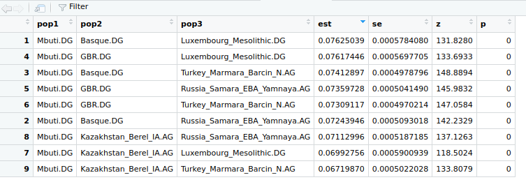
   
   En estos resultados se observa que todos los valores de Z son sobre 3, por lo tanto todos los resultados son significativos. Los que mas comparten una historia genética común son `Basque.DG` y `Luxembourg_Mesolithic.DG`. En la imagen se observan ordenados desde los que tienen una mayor historia comun hasta los que estan mas alejados genéticamente. Dicho de otra forma, los primeros comparten una mayor deriva genética.

3) Resultado f4

   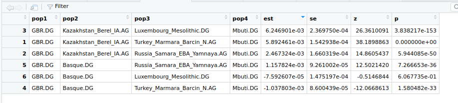
   
   Aqui se observa que los valores Z solo son menores a 3 en los ultimos 2 casos, por lo tanto estos valores no serian significativos (numeros 6 y 4). Por otro lado, par alos resultados en 3, 1, 2 y 5 se observan valores positivos, por lo tanto hubo un flujo genético entre GBR.DG y los individuos `Luxembourg_Mesolithic.DG`, `Turkey_Marmara_Barcin_N.AG` y `Russia_Samara_EBA_Yamnaya.AG`.

5) Resultado wave

   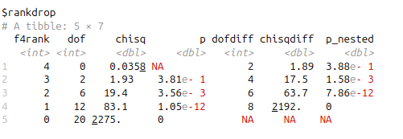
   
   Solo en el rank 3 se supera un valor p superior a 0.05, por lo tanto se necesita de al menos 4 fuentes ancestrales para explicar las poblaciones ubicadas en `target1` y `source1`.

7) Resultado qpAdm

   De todas formas se ejecutaron los codigos para 2 y 3 fuentes, los resultados fueron los siguientes:
   
    *  2 fuentes

   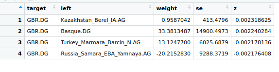
   
    *  3 fuentes

   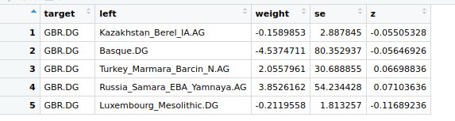
   
    En este caso en ambos modelos los resultados de Z son menores a 3, por lo tanto ninguno de los resultados es significativo y por tanto no se pueden sacar conclusiones, la causa de esto podria ser porque según el análisis previo con qpWave se llegó a la conclusión que al menos se necesitarian de 4 fuentes ancestrales.

## Project 2

Para resolver el siguiente proyecto se realizó el siguiente código:

```
# Project 2: Steppe formation model

## Modify names to match your dataset!

#### Load packages:
library(admixtools)
library(tidyverse)

#### Get f2_blocks. Only once for the entire project

target2 <- c("Russia_MLBA_Sintashta.AG", "Kazakhstan_Maitan_MLBA_Alakul.AG", "Russia_LBA_Srubnaya_Alakul.SG")
source2 <- c("Iran_GanjDareh_N.AG", "Russia_Sidelkino_HG.SG")
outgroup2 <- c("Mbuti.DG", "CHB.DG", "Papuan.DG", "Russia_UstIshim_IUP.DG", "Denisova.DG")


all_pops_p2 <- c(target2, source2, outgroup2)
prefix <- "v62.0_1240k_public"
outdir <- "aadr_1000G_f2_proyect2"

extract_f2(pref = prefix,
           outdir = outdir,
           pops = all_pops_p2,          # only populations to analyze
           overwrite = TRUE,
           blgsize = 0.05,            # block size in Morgans (default fine)
           verbose = TRUE)

#### Load f2_blocks
f2_blocks_p2 <- f2_from_precomp(outdir)

#### Outgroup-f3: shared drift between target and sources
#pop1=outgroup; pop2=target groups or populations; pop3=the ones to test shared drift with

f3_results_p2 <- f3(f2_blocks_p2, pop1="Mbuti.DG", pop2=target2, pop3=source2)


#### f4 tests: asymmetry checks. Are target populations closer to any of the potential sources?. Run one per each target population

f4_results_p2_1 <- f4(f2_blocks_p2, pop1="Russia_MLBA_Sintashta.AG", pop2= c("Kazakhstan_Maitan_MLBA_Alakul.AG", "Russia_LBA_Srubnaya_Alakul.SG"), pop3=source2, pop4="Mbuti.DG")
f4_results_p2_2 <- f4(f2_blocks_p2, pop1="Kazakhstan_Maitan_MLBA_Alakul.AG", pop2= c("Russia_MLBA_Sintashta.AG", "Russia_LBA_Srubnaya_Alakul.SG"), pop3=source2, pop4="Mbuti.DG")
f4_results_p2_3 <- f4(f2_blocks_p2, pop1="Russia_LBA_Srubnaya_Alakul.SG", pop2= c("Russia_MLBA_Sintashta.AG", "Kazakhstan_Maitan_MLBA_Alakul.AG"), pop3=source2, pop4="Mbuti.DG")


#### qpWave: test rank (how many ancestry streams are needed). Run one per each target population
wave_p2_1 <- qpwave(f2_blocks_p2,
                left = c(target2[3], source2),
                right = outgroup2)

wave_p2_2 <- qpwave(f2_blocks_p2,
                    left = c(target2[2], source2),
                    right = outgroup2)

wave_p2_3 <- qpwave(f2_blocks_p2,
                    left = c(target2[1], source2),
                    right = outgroup2)

wave_p2_1
wave_p2_2
wave_p2_3

#### qpAdm: 2-way mixture models. Run one per each target populations
admix_2way_p2_1 <- qpadm(f2_blocks_p2, left = c(target2[1], source2), right = outgroup2, target=target2[1])
admix_2way_p2_2 <- qpadm(f2_blocks_p2, left = c(target2[2], source2), right = outgroup2, target=target2[2])
admix_2way_p2_3 <- qpadm(f2_blocks_p2, left = c(target2[3], source2), right = outgroup2, target=target2[3])

View(admix_2way_p2_1$weights)
View(admix_2way_p2_2$weights)
View(admix_2way_p2_3$weights)
```

Los resultados obtenidos se detallan a continuación:

1) Resultado f3

   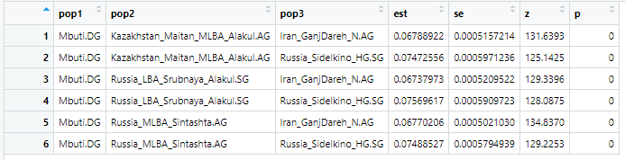

   Las tres poblaciones objetivo tienen ancestría significativa (z > 3) de ambas fuentes, con valores positivos para todas las combinaciones, lo que indica que estas poblaciones de la Edad de Bronce efectivamente comparten deriva genética con ambos grupos ancestrales (cazadores-recolectores del este de Europa y pastores neolíticos iraníes).

3) Resultados f4 para cada población target

   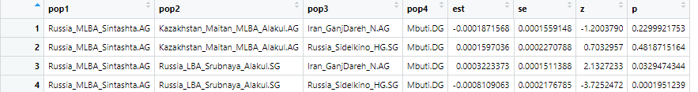
   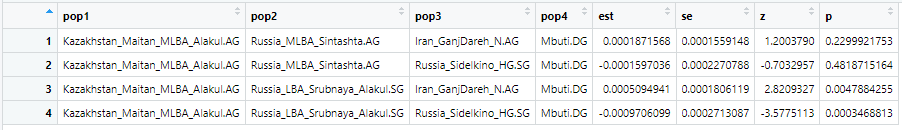
   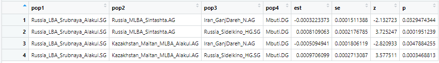

   * Valores negativos con `Iran_GanjDareh_N.AG`: La mayor parte de los f4 entre las poblaciones objetivo y `Iran_GanjDareh_N.AG` son significativamente negativos (valores Z < -3). Esto indica que las poblaciones objetivo comparten más deriva genética con `Iran_GanjDareh_N.AG` de lo esperado bajo un modelo sin mezcla.
   * Valores positivos con `Russia_Sidelkino_HG.SG`: Los f4 con `Russia_Sidelkino_HG.SG` son mayormente positivos (valores Z > 3), indicando afinidad genética adicional.
   El patrón de estadísticas f4 significativamente no-cero en múltiples configuraciones es evidencia inequívoca de que estas poblaciones están mezcladas, no relacionadas por un árbol filogenético simple.

5) Resultado wave

   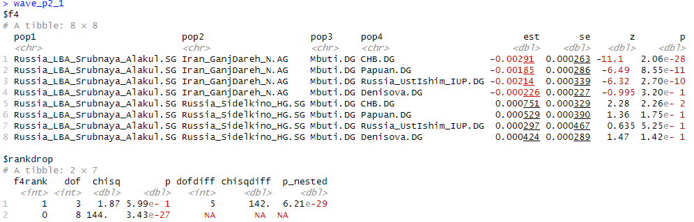
   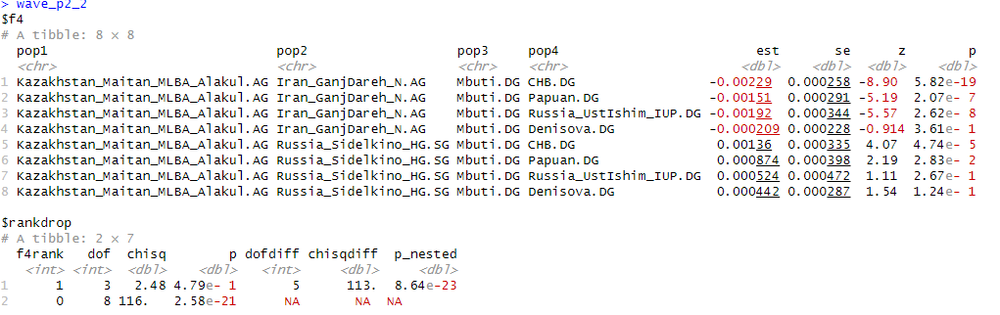
   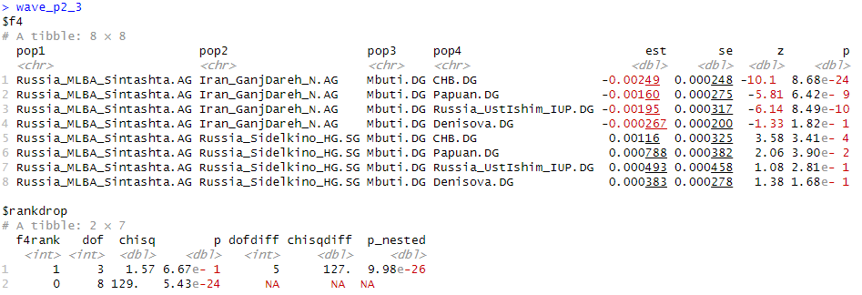

   En todas las combinaciones de poblaciones se puede observar que el f4rank que posee un valor de p > 0.05 es 1. Por lo tanto, las tres poblaciones objetivo (Sintashta, Alakul, Srubnaya) requieren al menos 2 flujos ancestrales independientes para ser explicadas adecuadamente. Un modelo con una sola fuente ancestral es estadísticamente inadecuado.

7) Resultado qpAdm
   En esta situación de proyecto se procedieron con modelos de dos vías para cada población target.

   Para `Russia_MLBA_Sintashta.AG`:

   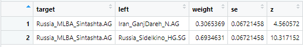
   
   * Iran_GanjDareh_N.AG: 30.7% (SE: 2.7%, Z: 4.56)
   * Russia_Sidelkino_HG.SG: 69.3% (SE: 2.7%, Z: 10.32)
   
   Para `Kazakhstan_Maitan_MLBA_Alakul.AG`:
     
   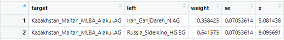

   * Iran_GanjDareh_N.AG: 35.8% (SE: 7.1%, Z: 5.08)
   * Russia_Sidelkino_HG.SG: 64.2% (SE: 7.1%, Z: 9.06)

   Para `Russia_LBA_Srubnaya_Alakul.SG`:

   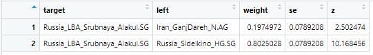
    * Iran_GanjDareh_N.AG: 19.7% (SE: 7.9%, Z: 2.50)
    * Russia_Sidelkino_HG.SG: 80.2% (SE: 7.9%, Z: 10.17)

   Todas las tres poblaciones de la Edad de Bronce pueden modelarse como mezclas de dos componentes ancestrales principales:

    * Una ancestría mayoritaria (~64-80%) relacionada con cazadores-recolectores del este de Europa (EHG/Sidelkino)
    * Una ancestría minoritaria (~20-36%) relacionada con pastores neolíticos de los Montes Zagros de Irán (Ganj Dareh)​

   La cultura Srubnaya muestra la menor contribución iraní (~20%), mientras que Alakul muestra la mayor (~36%), con Sintashta en una posición intermedia (~31%).

## Project 3

En este proyecto se utilizó el siguiente código:

```
# Project 3: Peopling of the Americas

## Modify names to match your dataset!

#### Load packages:
library(admixtools)
library(tidyverse)

#### Get f2_blocks. Only once for the entire project

target3 <- c("Pima.DG", "CLM.DG", "Bahamas_EleutheraIsl_Ceramic.AG", "Chile_Conchali_700BP.AG") #check for other ancient or present-day groups in the Americas.
source3 <- c("USA_Anzick_realigned.SG","USA_Ancient_Beringian.SG","USA_Nevada_SpiritCave_11000BP.SG")
outgroup3 <- c("Mbuti.DG", "CHB.DG", "Papuan.DG", "Russia_UstIshim_IUP.DG", "Denisova.DG")


all_pops_p3 <- c(target3, source3, outgroup3, "India_GreatAndaman_100BP.SG")
prefix <- "v62.0_1240k_public"
outdir <- "aadr_1000G_f2_proyect3"

extract_f2(pref = prefix,
           outdir = outdir,
           pops = all_pops_p3,          # only populations to analyze
           overwrite = TRUE,
           blgsize = 0.05,            # block size in Morgans (default fine)
           verbose = TRUE)

#### Load f2_blocks
f2_blocks_p3 <- f2_from_precomp(outdir)

#### Outgroup-f3: shared drift between target and sources
#pop1=outgroup; pop2=target groups or populations; pop3=the ones to test shared drift with

f3_results_p3 <- f3(f2_blocks_p3, pop1="Mbuti.DG", pop2=target3, pop3=source3)


#### f4 tests: asymmetry checks. Are target populations closer to any of the potential sources?. Run one per each target population

f4_results_p3_1 <- f4(f2_blocks_p3, pop1="Pima.DG", pop2=c("CLM.DG", "Bahamas_EleutheraIsl_Ceramic.AG", "Chile_Conchali_700BP.AG"), pop3=source3, pop4="Mbuti.DG")
f4_results_p3_2 <- f4(f2_blocks_p3, pop1="CLM.DG", pop2=c("Pima.DG", "Bahamas_EleutheraIsl_Ceramic.AG", "Chile_Conchali_700BP.AG"), pop3=source3, pop4="Mbuti.DG")
f4_results_p3_3 <- f4(f2_blocks_p3, pop1="Bahamas_EleutheraIsl_Ceramic.AG", pop2=c("Pima.DG", "CLM.DG", "Chile_Conchali_700BP.AG"), pop3=source3, pop4="Mbuti.DG")
f4_results_p3_4 <- f4(f2_blocks_p3, pop1="Chile_Conchali_700BP.AG", pop2=c("Pima.DG", "CLM.DG", "Bahamas_EleutheraIsl_Ceramic.AG"), pop3=source3, pop4="Mbuti.DG")


#### qpWave: test rank (how many ancestry streams are needed). Run one per each target population
wave_p3_1 <- qpwave(f2_blocks_p3,
                left = c(target3[1], source3),
                right = outgroup3)

wave_p3_2 <- qpwave(f2_blocks_p3,
                left = c(target3[2], source3),
                right = outgroup3)

wave_p3_3 <- qpwave(f2_blocks_p3,
                left = c(target3[3], source3),
                right = outgroup3)

wave_p3_4 <- qpwave(f2_blocks_p3,
                left = c(target3[4], source3),
                right = outgroup3)

wave_p3_5 <- qpwave(f2_blocks_p3,
                left = c(target3[1],"USA_Ancient_Beringian.SG","India_GreatAndaman_100BP.SG"),
                right = outgroup3)
wave_p3_6 <- qpwave(f2_blocks_p3,
                left = c(target3[2],"USA_Ancient_Beringian.SG","India_GreatAndaman_100BP.SG"),
                right = outgroup3)
wave_p3_7 <- qpwave(f2_blocks_p3,
                left = c(target3[3],"USA_Ancient_Beringian.SG","India_GreatAndaman_100BP.SG"),
                right = outgroup3)
wave_p3_8 <- qpwave(f2_blocks_p3,
                left = c(target3[4],"USA_Ancient_Beringian.SG","India_GreatAndaman_100BP.SG"),
                right = outgroup3)
wave_p3_1
wave_p3_2
wave_p3_3
wave_p3_4
wave_p3_5
wave_p3_6
wave_p3_7
wave_p3_8

#### qpAdm: 2 or 3-way mixture models. Run one per each target populations
admix_2way_p3_1 <- qpadm(f2_blocks_p3, left = c(target3[1], source3[1:2]), right = outgroup3, target=target3[1])
admix_2way_p3_2 <- qpadm(f2_blocks_p3, left = c(target3[2], source3[1:2]), right = outgroup3, target=target3[2])
admix_2way_p3_3 <- qpadm(f2_blocks_p3, left = c(target3[3], source3[1:2]), right = outgroup3, target=target3[3])
admix_2way_p3_4 <- qpadm(f2_blocks_p3, left = c(target3[4], source3[1:2]), right = outgroup3, target=target3[4])

View(admix_2way_p3_1$weights)
View(admix_2way_p3_2$weights)
View(admix_2way_p3_3$weights)
View(admix_2way_p3_4$weights)
```

Los resultados obtenidos se detallan a continuación:

1. Resultado f3

   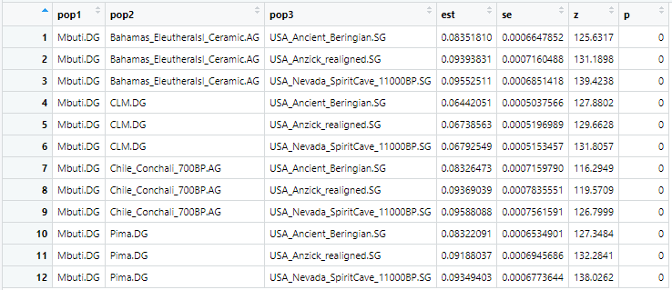

   Los valores son notablemente altos y estadísticamente significativos (z-scores extremadamente elevados), lo que revela que existe una fuerte deriva genética compartida entre cada población americana y cada fuente del norte analizada. Esto sugiere un origen común o un alto grado de mezcla entre las poblaciones estudiadas y estas ramas fundadoras norteamericanas, confirmando la afinidad genética panamericana entre los grupos nativos antiguos y actuales.

3. Resultados f4 para cada población target

   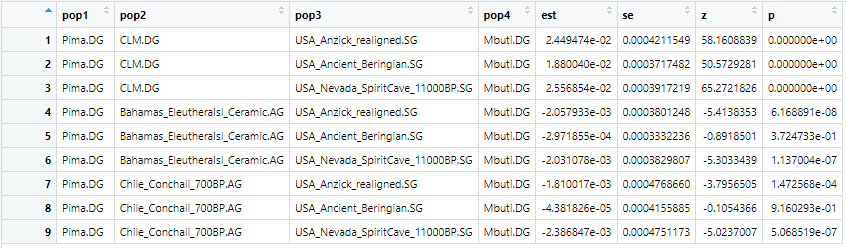
   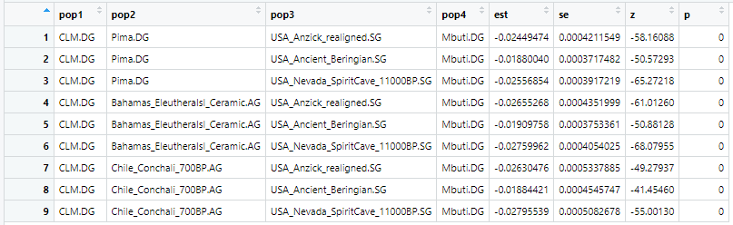
   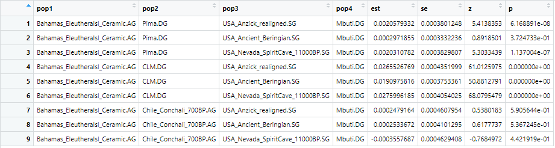
   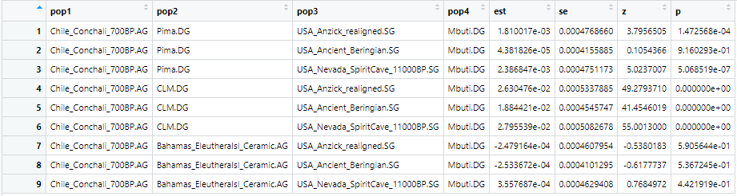

   En este caso poseemos ambas situaciones tanto valores negativos o positivos, que poseen distintas interpretaciones. Por lo que:

   * Valores negativos de f4 con significancia estadística (z < -3) indican que la población objetivo comparte más afinidad genética con la fuente comparada que lo esperado bajo un modelo de árbol simple sin mezcla. Esto sugiere eventos de mezcla históricamente relevantes y una relación genética más fuerte de la población americana con esa fuente ancestral específica.
   * Valores positivos o cercanos a cero: Reflejan ya sea una relación simétrica o indefinida entre la target y la fuente usada en la comparación. En general, no evidencian una mezcla genética extra por encima de lo esperado.

5. Resultado wave
  
   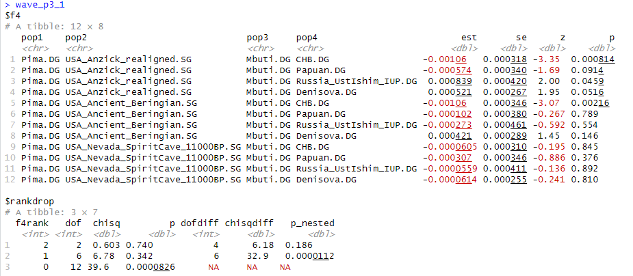
   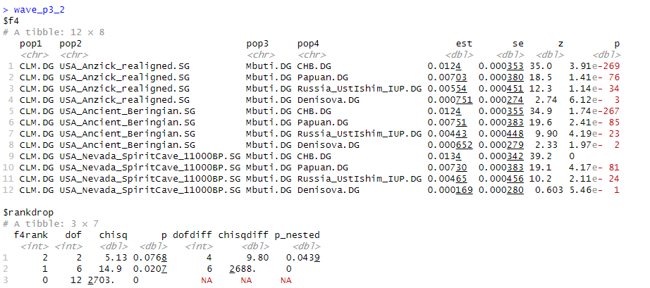
   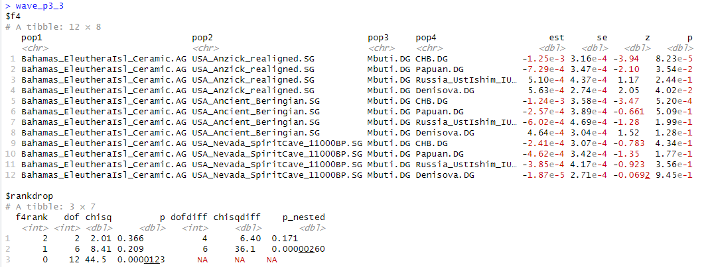
   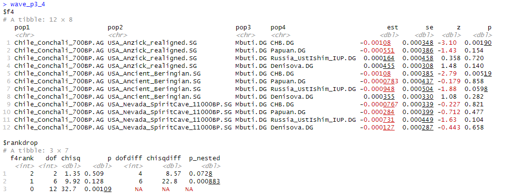
   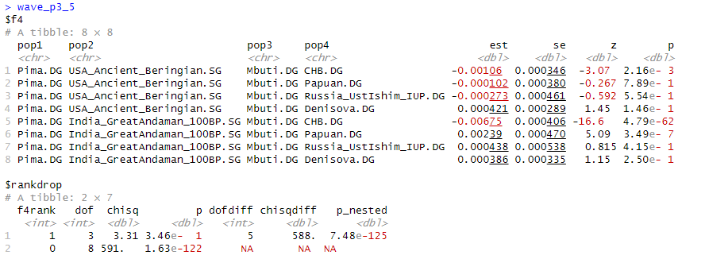
   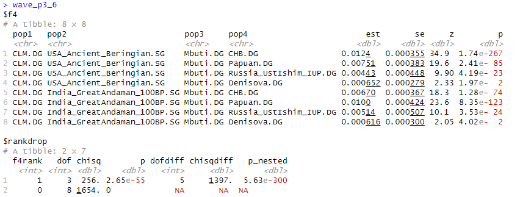
   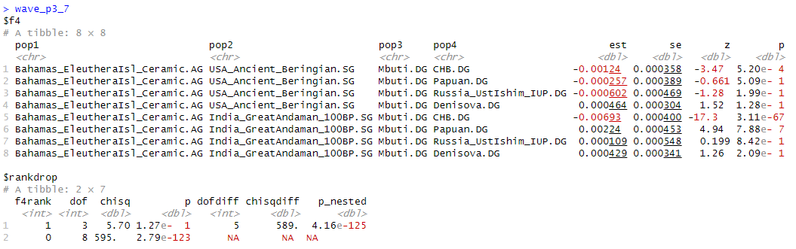
   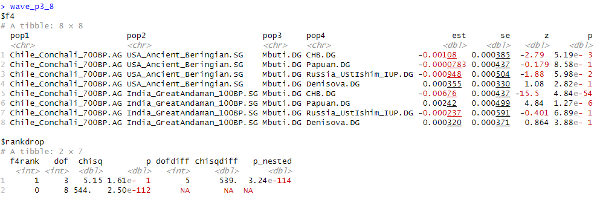

   En la mayoría de los casos, los modelos con dos o tres fuentes ancestrales (f4rank 2 o 3) tienen p-valores altos (0.36–0.74), lo que significa la historia genética de los americanos requiere al menos dos o tres linajes ancestrales principales.
   Por lo que esta situación sería un modelo de mezcla complejo, donde las poblaciones americanas modernas y caribeñas (como CLM, Bahamas, Pima) y antiguas (Chile_Conchali_700BP) son resultado de al menos dos o tres migraciones independientes o linajes genéticos diferenciados.

7. Resultado qpAdm

   Para Pima.DG

   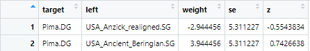

   Para CLM.DG

   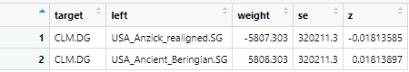

   Para Bahamas_EleutheraIsl_Ceramic.AG

   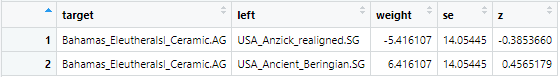

   Para Chile_Conchali_700BP.AG

   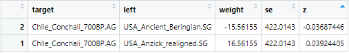

   En esta situación de proyecto se procedieron con modelos de dos vías para cada población target.

   Para todos los targets `(Pima.DG, CLM.DG, Bahamas_EleutheraIsl_Ceramic.AG, Chile_Conchali_700BP.AG)`, los valores de "weight" (proporciones de mezcla) son negativos o extremadamente altos, mientras que los errores estándar (se) son enormes y los valores de Z son bajos. Esto es evidencia de un modelo no identificable o no realista ya sea que las fuentes seleccionadas son demasiado similares entre sí (es lo más probable dado el caso), o sus perfiles genéticos no representan adecuadamente los linajes ancestrales reales de los targets.

   Biológicamente, estos resultados indican que las poblaciones indígenas americanas no pueden explicarse con precisión como una mezcla simple de sólo esas dos fuentes norteamericanas, su acervo genético es más complejo y probablemente requiere otros linajes o fuentes, tal como sugiere el qpWave (necesidad de ≥3 streams de ancestralidad).

## Project 4

En este caso se uso el siguiente codigo:

```
# Project 4: Medieval / Iberian admixture

## Modify names to match your dataset!

#### Load packages:
library(admixtools)
library(tidyverse)

# Set working directory
setwd("/home/ahumada_quintanilla/Escritorio/Bioinformatica/popgen_shared")

# Load metadata
metadf = read.table("v62.0_1240k_public_metadata2.csv", header = T, sep = ",")
#### Get f2_blocks. Only once for the entire project

target4 <- c("Spain_Islamic.AG","Spain_Medieval.AG","Spain_NazariPeriod_Muslim.AG","Spain_Islamic_Zira.AG","Spain_Visigoth_Granada.AG") 
source4 <- c("Spain_MLN.AG", "Morocco_EN.WGC.SG", "Yoruba.DG") 
outgroup4 <- c("Ethiopia_4500BP.SG", "Han.DG", "CHB.DG", "Papuan.DG", "Russia_UstIshim_IUP.DG")


all_pops <- c(target4, source4, outgroup4, "Mbuti.DG")
prefix <- "v62.0_1240k_public"
outdir <- "aadr_1000G_f2_proyect4"

extract_f2(pref = prefix,
           outdir = outdir,
           pops = all_pops,          # only populations to analyze
           overwrite = TRUE,
           blgsize = 0.05,            # block size in Morgans (default fine)
           verbose = TRUE)

#### Load f2_blocks
f2_blocks <- f2_from_precomp(outdir)

#### Outgroup-f3: shared drift between target and sources
#pop1=outgroup; pop2=target groups or populations; pop3=the ones to test shared drift with

f3_results <- f3(f2_blocks, pop1="Ethiopia_4500BP.SG", pop2=target4, pop3=source4)


#### f4 tests: asymmetry checks. Are target populations closer to any of the potential sources?. Run one per each target population

f4_results <- f4(f2_blocks, pop1="Spain_Islamic.AG", pop2=c("Spain_Medieval.AG","Spain_NazariPeriod_Muslim.AG","Spain_Islamic_Zira.AG","Spain_Visigoth_Granada.AG"), pop3=source4, pop4="Mbuti.DG")


#### qpWave: test rank (how many ancestry streams are needed). Run one per each target population
wave2<- qpwave(f2_blocks,
                left=  c(target4[1], source4),
                right= outgroup4)
wave2

wave3 <- qpwave(f2_blocks,
                left = c(target4[2], source4),
                right = outgroup4)
wave3

wave4 <- qpwave(f2_blocks,
                left = c(target4[3], source4),
                right = outgroup4)
wave4
wave5 <- qpwave(f2_blocks,
                left = c(target4[4], source4),
                right = outgroup4)
wave5

wave6 <- qpwave(f2_blocks,
                left = c(target4[5], source4),
                right = outgroup4)
wave6

#### qpAdm: 2 or 3-way mixture models. Run one per each target populations
#2-way
admix_2way1 <- qpadm(f2_blocks, left = c(target4[1], source4[1:2]), right = outgroup4, target=target4[1])
admix_2way2 <- qpadm(f2_blocks, left = c(target4[2], source4[1:2]), right = outgroup4, target=target4[1])
admix_2way3 <- qpadm(f2_blocks, left = c(target4[3], source4[1:2]), right = outgroup4, target=target4[1])
admix_2way4 <- qpadm(f2_blocks, left = c(target4[4], source4[1:2]), right = outgroup4, target=target4[1])
admix_2way5 <- qpadm(f2_blocks, left = c(target4[5], source4[1:2]), right = outgroup4, target=target4[1])
view(admix_2way1$weights)
view(admix_2way2$weights)
view(admix_2way3$weights)
view(admix_2way4$weights)
view(admix_2way5$weights)

#3-way
admix_3way1 <- qpadm(f2_blocks, left = c(target4[1], source4), right = outgroup4, target=target4[1])
admix_3way2 <- qpadm(f2_blocks, left = c(target4[2], source4), right = outgroup4, target=target4[1])
admix_3way3 <- qpadm(f2_blocks, left = c(target4[3], source4), right = outgroup4, target=target4[1])
admix_3way4 <- qpadm(f2_blocks, left = c(target4[4], source4), right = outgroup4, target=target4[1])
admix_3way5 <- qpadm(f2_blocks, left = c(target4[5], source4), right = outgroup4, target=target4[1])
view(admix_3way1$weights)
view(admix_3way2$weights)
view(admix_3way3$weights)
view(admix_3way4$weights)
view(admix_3way5$weights)
```

Los resultados fueron los siguientes:

1) Resultados f3

   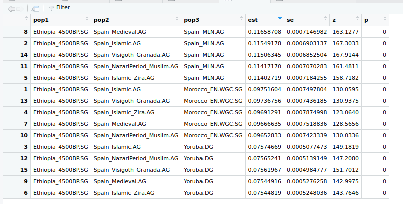

   Aqui observamos que todos los valores de Z son mayores a 3, por lo tanto todos los resultados obtenidos son significativos. En este caso los que mas comparten una historia comun son `Spain_Medieval.AG` y `Spain_MLN.AG`. Ademas, se observa que el análisis resulta ser consistente ya que las poblaciones que tienen una mayor historia comun son las que estan geográficamente relacionadas y lo mas probable es que vengan del mismo origen evolutivo o que compartan algun antepasado común mas reciente en el tiempo.

   Por otro lado los que tienen menos historia evolutiva común son Spain_Islamic_Zira.AG y Yoruba.DG, es decir tienen menos deriva génica entre sí.

3) Resultado f4

   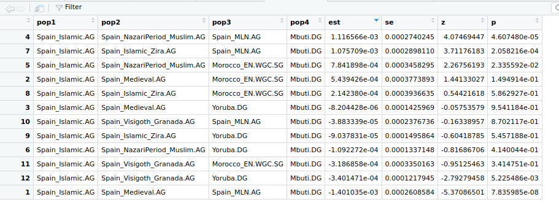

   Solo se observaron valores de Z mayores a 3 en la posicion 4 y 7 de la tabla de resultados (ordenados de mayor a menor segun el valor de est ambos datos se ubican al inicio de la tabla). Por lo tanto, los datos sólo son significativos en esos dos análisis, debido a que el valor de este es positivo se puede concluir que existe una flujo genetico entre `Spain_Islamic.AG` y `Spain_MLN.AG`.
   
4) Resultado qpWave

   Se realizó el análisis de qpWave para cada uno de los targets.

   Los resultados fueron los siguientes:

   Wave2

      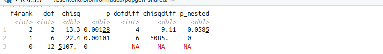

   Wave3

      

   Wave4

      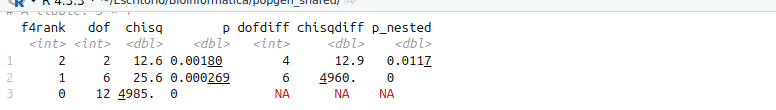

   Wave5

      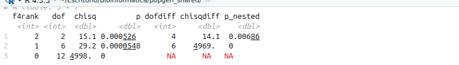

   Wave6

      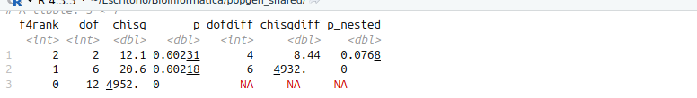

   En todos los casos se observa que ningun valor p supera el 0.05, por lo tanto con 3 fuentes de ascendencia que se analizaron en cada uno de los casos no es suficiente para explicar la poblacion target estudiada, por lo tanto es probable que se necesiten de mas fuentes de ascendencia. 

5) Resultados qpAdm

   Segun el análisis anterior es mas lógico utilizar el qpAdm de 3 vías o mas, de todas formas se ejecutaron los programas con 2 y 3 vías.
   
    2 Fuentes:

   view(admix_2way1$weights)

   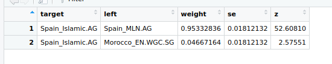
   
   view(admix_2way2$weights)

   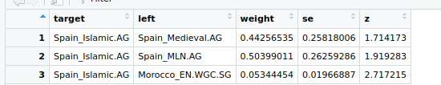
   
   view(admix_2way3$weights

   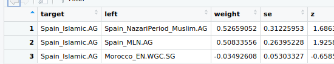
   
   view(admix_2way4$weights)

   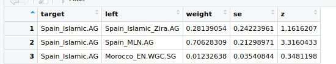
   
   view(admix_2way5$weights)

   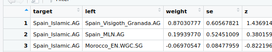
   
   Solo en `Spain_Islamic.AG` y `Spain_MLN.AG`, y `Spain_Islamic.AG` y `Spain_MLN.AG` se observo un valor de Z superior a 3. En ambos casos se estan comparando a la misma población pero el valor weight es diferente, se supera el 0.7 de aporte de la anscestría de `Spain_MLN.AG`, sobre `Spain_Islamic.AG`.
   
   3 Fuentes

   view(admix_3way1$weights)

   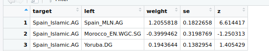
   
   view(admix_3way2$weights)

   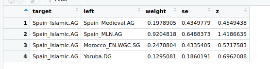
   
   view(admix_3way3$weights)

   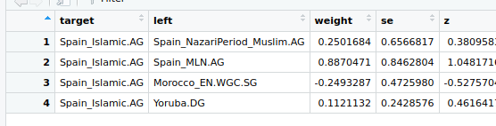
   
   view(admix_3way4$weights)

   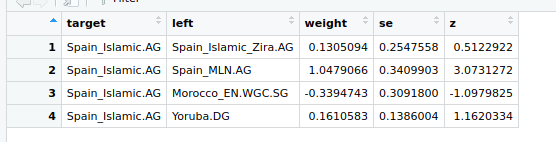
   
   view(admix_3way5$weights)

   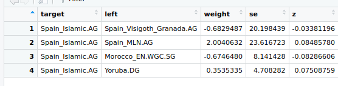
   
   Aqui, sólo en 2 se observó un valor Z superior a  3, pero los resultados de weight de estos dos es superior a 1, por lo tanto los resultados no son válidos y no podemos sacar buenas conclusiones.
