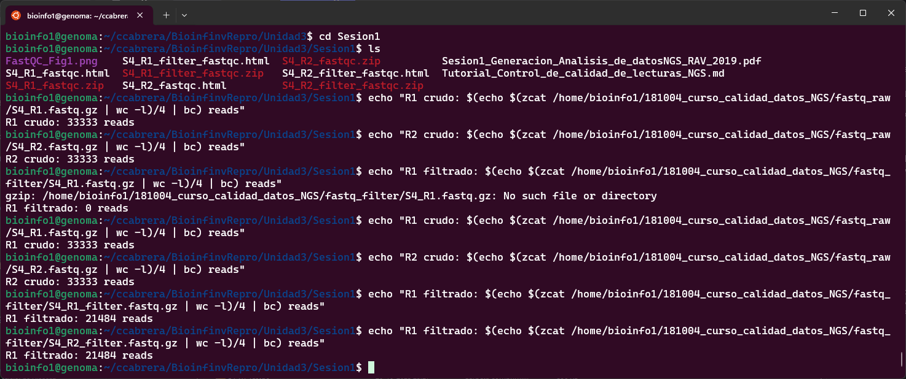
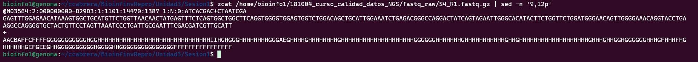

# Tarea Unidad 3 -Sesión 1
**Camilo Cabrera** 
**20.10.2025**
-----------------------
Realizar las siguientes tareas tanto para las secuencias crudas y podadas. Además de generar los informes de calidades deben realizar una comparación de los 
resultados. Recuerden que la ubicación de las secuencias crudas 
es en el directorio: 181004_curso_calidad_datos_NGS/fastq_raw/ y las secuencias ya podadas se encuentran en 181004_curso_calidad_datos_NGS/fastq_filter

#### 1. Usando comandos Unix:
   
   * Contar el número de lecturas (reads) en un archivo fastq **R: R1 y R2 sin filtrar tienen 33333 lecturas y filtrados tienen 21484 lecturas.**
     * Mediante el siguiente script en Unix se puede realizar el conteo de reads en la muestra S4 (R1 y R2) y el resultado se observa en la *[Figura 1](./images/fig1.png)*:
```
echo "R1 crudo: $(echo $(zcat /home/bioinfo1/181004_curso_calidad_datos_NGS/fastq_raw/S4_R1.fastq.gz | wc -l)/4 | bc) reads"
echo "R2 crudo: $(echo $(zcat /home/bioinfo1/181004_curso_calidad_datos_NGS/fastq_raw/S4_R2.fastq.gz | wc -l)/4 | bc) reads"

echo "R1 filtrado: $(echo $(zcat /home/bioinfo1/181004_curso_calidad_datos_NGS/fastq_filter/S4_R1_filter.fastq.gz | wc -l)/4 | bc) reads"
echo "R2 filtrado: $(echo $(zcat /home/bioinfo1/181004_curso_calidad_datos_NGS/fastq_filter/S4_R2._filterfastq.gz | wc -l)/4 | bc) reads"
```

   * Previsualizar las primeras 40 líneas del mismo archivo fastq
       * Mediante el siguiente script en Unix se puede visualizar las primeras 40 líneas
```
zcat /home/bioinfo1/181004_curso_calidad_datos_NGS/fastq_raw/S4_R1.fastq.gz | head -n 40
```
Y el resultado es el siguiente, que también puede ser observado en la *[Figura 2](./images/fig2.png)*:
```
@M03564:2:000000000-D29D3:1:1101:14835:1364 1:N:0:ATCACGAC+CTAATCGA
AGTTTGTTCTACTTACTCCAAAGATTCAGAAAACTACTTTGAAACAGAAGCAGTAGAAATTGCTAAAGCTTTTATGGAAGATGATGAACTGACAGATTCTAAACTGCCAAGTCATGCCACACATTCTCTTTTTACATGTCCCGAAAATGAGGAAATGGTTTTGTCAAATTCAAGAATTGGAAAAAGAAGAGGAGAGCCCCTTATCTTAGTGGGTAAGTGTTCATTTTTACCTTTCGTGTTGCCGCGAATTT
+
CCCDCFFFFFFFGGGGGGGGGGHHHHHHHHHHHHHHHHHHHHHHHHHHHHHHHHHHHIIIIHHIIHHHHHHHHHHHHHHHHHHHHHHHHHHHHHHHHHHHHHHHHHHHHHHHHHHHHHHHHGGHHHHHHHGHHHHHHHIHHHGGGGGHHHHHHHHHHHHHHGHHHHHHHHHHHHHHHHHHHHHHHGGHGGHGHGHGHHGGHHHHHHHHHFHGHGGHGHHHHHGHHHHHHHHGHHHGGGGGHEGGGGGGGGF
@M03564:2:000000000-D29D3:1:1101:14805:1376 1:N:0:ATCACGAC+CTAATCGA
ATACTAACTCTCCAAGGACGAACCTAGGACTTTTGCTGTCGAGGTTAGTATGTCGCGAATTTCGACGATCGTTGCATTAACTCGCGAATCACGACATCTCGTATGCCGTCTTCTGCTTGAAAAAAAAAAAAAACAAAAATAAAAGTAACTTATCCTAAAAATACATTGTGACTAATACAAGACTCACCATAAGACATTAAAACATCAGCAATAATTACACATCACAAGTAAAAAACCTCGATTCGATACGA
+
DDEEEFFFFFFFGGGGGGGGGGGGHHHHHHHHHHHHHHHHGHGGGHHHHGHHHHHHGGGGHHHHGGGGGHGHHHGHHHHHHHHGGGGGGGHHGGGGDGHHHGGHHHHGGGHGHHHFHHHFHHHHGGGGG-<<-.......011110111110111111000.00011<11111101:1000//<00<.0000110/11111:09000001/0101111100000000:11111:-..//.</11.1:.-.<
@M03564:2:000000000-D29D3:1:1101:14470:1387 1:N:0:ATCACGAC+CTAATCGA
GAGTTTGGAGAACATAAAGTGGCTGCATGTTCTGGTTAACAACTATGAGTTTCTCAGTGGCTGGCTTCAGGTGGGGTGGAGTGGTCTGGACAGCTGCATTGGAAATCTGAGACGGGCCAGGACTATCAGTAGAATTGGGCACATACTTCTGGTTCTGGATGGGAACAGTTGGGGAAACAGGTACCTGAAGGCCAGGGGTGCTACTGTTCCTAGTTAAATCCCTGATTGCGAATTTCGACGATCGTTGCATT
+
AACBAFFCFFFFGGGGGGGGGGGHGGHHHHHHHHHHHHHHHHHHHHHHHHHHHHHHHIIHGHGGGHHHHHHHHGGGAEGHHHHGHHHHHHHHGHHHHHHHHHHHHHHHHHHHHGGGGGGHHHHHHHGHHHHHHHHHHHGHHGHHHHHHHHHHHHHHHHHHHGHHHGHHGGHGGGGGGHHHGFHHHFHGHHHHHHGEFGEEGHHGGGGGGGGGGHGGGGHHGGGGGGGGGGGGGGGFFFFFFFFFFFFFFFF
@M03564:2:000000000-D29D3:1:1101:15152:1399 1:N:0:ATCACGAC+CTAATCGA
CAATTTCCTTGGCCCCAGGCCAGGGTGGTTACCTGGCTAGGCTGGGGGAACCCTCCAGTGGGCCCTCGTCAGCAACCTCGGGTTTGGGGTCAGGCAGGGGGATGATATAGTCGTTGTCACCCTCATTGGGCTGCACGGCAGTATAGAGGACGGAGCTGGTGTCCAGGGGAGATCGGAGGCCATGGAACCCAGGCAAGCGGGCCTGGGACCGAAGGATGGCTGGGTGGTCACTCCTCAGAAACTCCTCATCC
+
BBBBBFFFFFFFGGGGG2FGGGHHCGFGGGHHHHHHHHGHHHHHEFGGGEEGDEGGHHHHHHGHGHHGHGHGHHGHHHHGGGFFGGGGGGGHHHHHGGGGCGGGHHHHHHHHGGGGGHHHHHHHHHHFHHHHGGHHGGGGGHHHHGHFEGHGGGGGHHGGGGGGGFGGGGGGGGGBEF?AFFFFEFFFFFFFFFFF?EFFFFFFFFFFFFA-D@FEFFFFFFFF/;;ABFB/BFFFFFFFB/FFBBBBBFF
@M03564:2:000000000-D29D3:1:1101:17044:1415 1:N:0:ATCACGAC+CTAATCGA
TTCACAGAACAGTAAAACCCAGTTATTAGACGTGTCTTACCAGAGGAGCTCGAAGTTTCATCTTTCTTCTCTTCTTCTTCTTTATCATTGTTCTCTCCCCCCGTTTCAGTCCCTGCTTCCCTATCACTGTCTGTATCCTTTGATTCCAGCACATTAATGGTGGGGGTGCTGGGCCTGCTACTGTTATTGGGAAGCCGTCCTCTTCTGCGGCCTCCTGGACGTTTTGGTGGGGTCTTTATCCGCTCAGCGGG
+
CCEEEFFFFFFFGGGGGGGGGGHHHHHHHHHGGGHHHHHHHHHHHGHGHHHGGHGGHHHHHHHHHHHHHHHHHHHHHHHHHHHHHHHHHHHHHHHHHHHGGGGGHHHHHHHHHHHHHHHHHHHHHHHHHHHHHHHHHHHHHHHHHHHHGHHHHHHHHHHHHHGGGGGGGHHHGHHGGHHHHHHHHHHHGHHHHGHHGGGGGHHHHHHHGGGGGGGGGGFFCFGGGGCFFFFFFFFFFFFFFFFDFFFFFF-
@M03564:2:000000000-D29D3:1:1101:15598:1421 1:N:0:ATCACGAC+CTAATCGA
ACATCATCCTTGGTTCAGCCCCAATCCCAATACCAGCTGAGTCAGATGACATTTCACAAGATCCCTGCTGACAGCCTGGAGTGGGTAAGAGGCCCTGGGAAATGAGGCGATACCTCAGTCTGGGGTCCAGAGACTCAGATGCGTGGCCTCAGGCATATGCTATAATTTTACCTTGCCTCGGTTTTCCCATCTGTAAAATGGGGCCAGCAGCTATGTCTCGCTTGGGCTGGGATCCTGCAGGAACCCCCTCA
+
BCCCCFFFFFFFGGGGGGGGGGGGHHHHHHHHHHHHHHHHHHHHHHHHHHHHHHHHHHHHHHHHHHHHHHHHHHHHHHHHHHHGHGHHHHHGGGGHHHGHHHHHHHHGGGGGGHHHHHHHHHHHGGGHHHHHHHHHHHHHHHGGGGGHHHHHHHHHHHHHHHGHHHHHHHHHGHGHHHHGGGGGGFHHHHGHHHHHHHHHGHGGGGHGGGGGGGGGGGGGGGGGGGGGGGGGGGGGGFFFFFFFFFFFFF.
@M03564:2:000000000-D29D3:1:1101:16900:1423 1:N:0:ATCACGAC+CTAATCGA
GCTCGCGAATTTCGACGATCGTTGCATTAACTCGCGAATCACGACATCTCGTATGCCGTCTTCTGCTTGAAAAAAAAAAAAACAAAATAAAGCAAAAAACCAAATTCCAGCTATATTTAAAATCAATATAATTACAACAGTACAATTATTCGTGTCTTTTCAACTATATTTACTTATTTTGCAATTCTGTAGTAAGAATATTTCTATGGATACAATTTCATTCATTGAGATTATATACTATACTATGCTTA
+
BCCDCDCDDEEFGGGGGGGGGGHHGHHHHHHHHGGGGGGGHHGGGGGHHHHGGHHHHGGGHGHHHHHHHHHHHHGGGGG>/>///001?11111??0?->....11>111/0=111111=1110<0111111111110./11111111111//../111<<11110<1111111:1111110111<111111111111<1:1<111<10111010:1111<111111:0.111::111111<11::<0111
@M03564:2:000000000-D29D3:1:1101:16763:1431 1:N:0:ATCACGAC+CTAATCGA
CTTTATGCCTCCTCTCCACCCCCTCCCCAGGACAATAGTCCCTTGGAAGAGCTTTCGACAGGCTCTACATGAAGTGCATCCCATCAGTTCTGGGCTGGAGGCCATGGCTCTGAAATCCACTATTGATCTGACCTGCAATGATTATATTTCGGTTTTTGAATTTGACATCTTTACCCGACTCTTTCAGGTAGGACACTAAAAAGTTGACTAAACTGGTTACTGCTACTTCGGTGAGCGAATTTCGACGATCG
+
BBBBBFFFFFFBGGGGGGGGGGGGGGGGHGGHHHHHHHHHHFGH2EGFHEGFFGHGEFGGEEFHHEGHHFEFGFHHHHHHHHHHHHHHHHFHHHHHGCHHGGGHHGHHHHHHGHHHHHHHHGHHHHBGFGHHHHHHHHHHHHHHHHHGHHHGFDGGGGGHHHHHBHHHHHHHHHHHDGGGGHHHHHHHHHHFHHHHHHCFHFGGHHHHHHHGHHGHHHHFGFFGFFGGGGFEFFGEAGGGFGGGGGFFFF-
@M03564:2:000000000-D29D3:1:1101:16155:1443 1:N:0:ATCACGAC+CTAATCGA
TGTGCCATATGGTAGAACAATTGTGTGGTGACAGGGGAGTGAGTTTTGTCTCTTCCATTGCAGCTTAAGAGCAGTGTAATTAGTAGGTTCCCCCCCCCCCCACCCCCCCAAGGGAAAAAATTTTAAATAATATTTTTTTTTTTTTTTATTTTTTTTAAGTTTTTGTTTTTTTTTAAAATTTAAAATATTTAAACCTTTAATTTTTTTTAGGTTTTTTTTAACCCACCCCGGAAAATCAGAGATGTATATTG
+
CDCCDFFFFFFFGGGGGGGGGGHHHHHGHGHHHHGGGGGGHHHHHHHHHHHHHHHHHHHHHHHHHHHHHHHHHHHHHHHHHHHHHHGHHHFHHGGGGGGG/////>DC///?<.<0F0>-<CFG00000000<0=DG-@-ADGF?A;.0<FFF-@-.0000:0.-<//:9B-@-.BF00:00:00000000:0<//<00000<0FF=@./0000..<@A.0<0.<<.9-<--99/00000:/00<000:00
@M03564:2:000000000-D29D3:1:1101:16771:1449 1:N:0:ATCACGAC+CTAATCGA
ACGAAATAAAGACGCACAGACTATGAAAGTGAAGATGACAATCATGTTGCAGCGCGAATTTCGACGATCGTTGCATTAACTCGCGAATCACGACATCTCGTATGCCGTCTTCTGCTTGAAAAAAAAAAAAACAAATGATGCATTTGCATGTTGTTATTTCTGTGGCATGTTGCTCCCTCTTCTCTTCCTTACTCGTTATGGCATTGCTTCTGTAAGTGCTCACTTAGCTGGCTGCAGGTTTGATTGCATAC
+
CCCCCCCFFFFFGGGGGGGGGGHHHHHHHGHHHHHHGHHHHHHHHHHHHHHHHGGGGGGHHHHGGGGGHGHHHGHHHHHHHHGGGGGGGHHGGGGGHHHHFDHHHHGGFHGHHHHFHBHHHHHGGG?C<-:....0;0000::;;00:00900/.0000000;0/9/9.;000:00.///000009009:0900.:.9.00./;0;000000000000900090000000/:9;./9..00.00000099:
```
   * Ubicar la lectura 3 e identificar la información disponible. Describir en detalle la información entregada. ¿Donde se entrega la calidad del read?, ¿Cuál es el ID (identificador) del read? Etc. Utilice fechas y etiquetas para identificar cada parte.
       * Mediante el siguiente script en Unix se puede ubicar la lectura 3 con su información:
```
zcat /home/bioinfo1/181004_curso_calidad_datos_NGS/fastq_raw/S4_R1.fastq.gz | sed -n '9,12p'
```
Y el resultado es el observado en la *[Figura 3](./images/fig3.png)*


La información entregada es la siguiente, comenzando por la línea 1, que es el identificador de lectura(ID) `@M03564:2:000000000-D29D3:1:1101:14470:1387 1:N:0:ATCACGAC+CTAATCGA`, cada elemento se describe en la siguiente tabla:
|Etiqueta| Valor| Descripción|
|---|---|---|
|Símbolo inicial| @| Marca el inicio de un nuevo read en formato FASTQ|
|Instrument ID| M03564| Identificador único del secuenciador Illumina MiSeq utilizado|
|Run number| 2| Número de la corrida de secuenciación en ese instrumento|
|Flowcell ID| 000000000-D29D3| Identificador de la celda de flujo (flowcell) donde se realizó la secuenciación|
|Lane| 1| Número del carril (lane) en la flowcell|
|Tile| 1101| Número del tile (sección física de la flowcell donde se capturó la imagen)|
|X-Pos| 14470| Coordenada X del cluster en el tile (posición horizontal)|
|Y-pos| 1387|	Coordenada Y del cluster en el tile (posición vertical)|
|Read|	1|	Indica que es el primer read del par (R1) en secuenciación paired-end|
|Is filtered|	N|	La lectura NO fue filtrada por el software del secuenciador (Y = filtrada, N = no filtrada)|
|Control number|	0|	Bits de control (0 = muestra real, no control de calidad)|
|Index sequence|	ATCACGAC+CTAATCGA|	Secuencias de índices duales (dual indexing) que identifican la muestra S4. El símbolo + separa el índice i7 del índice i5|

Luego en la línea 2, se entrega la secuencia de nucleótidos `GAGTTTGGAGAACATAAAGTGGCTGCATGTTCTGGTTAACAACTATGAGTTTCTCAGTGGCTGGCTTCAGGTGGGGTGGAGTGGTCTGGACAGCTGCATTGGAAATCTGAGACGGGCCAGGACTATCAGTAGAATTGGGCACATACTTCTGGTTCTGGATGGGAACAGTTGGGGAAACAGGTACCTGAAGGCCAGGGGTGCTACTGTTCCTAGTTAAATCCCTGATTGCGAATTTCGACGATCGTTGCATT`, donde se observan 251 bases de una secuencia de ADN, donde hay A,T,C, G y no hay bases ambiguas(N).

Tras esto hay un separador como línea 3 (+) y luego cómo línea 4 se expone el string de calidad `AACBAFFCFFFFGGGGGGGGGGGHGGHHHHHHHHHHHHHHHHHHHHHHHHHHHHHHHIIHGHGGGHHHHHHHHGGGAEGHHHHGHHHHHHHHGHHHHHHHHHHHHHHHHHHHHGGGGGGHHHHHHHGHHHHHHHHHHHGHHGHHHHHHHHHHHHHHHHHHHGHHHGHHGGHGGGGGGHHHGFHHHFHGHHHHHHGEFGEEGHHGGGGGGGGGGHGGGGHHGGGGGGGGGGGGGGGFFFFFFFFFFFFFFFF`, donde se puede observar la calidad del read.

   * Traducir el código de calidad para las primeras 10 bases del tercer read a valores numéricos (Q) usando la codificación entregada en clase.
    * Mediante el siguiente script en Unix se puede extraer las primeras 10 bases del tercer read y sus carácteres de calidad para luego traducirlos a valores númericos Q, cuyo resultado se puede ver en la *[Figura 4](./images/fig4.png):
```
awk '
BEGIN {
  print "Pos | Base | Char | ASCII | Q Score"
  print "----|------|------|-------|--------"
}
{
  # $1 = base, $2 = calidad
  cmd = "printf \"" $2 "\" | od -An -tuC"
  cmd | getline ascii
  close(cmd)
  q = ascii - 33
  printf("%3d | %4s | %4s | %5d | %7d\n", NR, $1, $2, ascii, q)
  if (NR == 10) exit
}
' <( 
  zcat /home/bioinfo1/181004_curso_calidad_datos_NGS/fastq_raw/S4_R1.fastq.gz \
    | sed -n '10p;12p' \
    | fold -w1 \
    | paste - - 
)
```

#### 2. Genere un informe de calidad con FastQC para una muestra (cada estudiante una muestra distinta), para R1 y R2.
  * Mediante el siguiente script se puede generar un informe de calidad con FastQC para R1 y R2:
```
fastqc /home/bioinfo1/181004_curso_calidad_datos_NGS/fastq_raw/S4_R1.fastq.gz -o /home/bioinfo1/ccabrera/BioinfinvRepro/Unidad3/Sesion1
fastqc /home/bioinfo1/181004_curso_calidad_datos_NGS/fastq_raw/S4_R2.fastq.gz -o /home/bioinfo1/ccabrera/BioinfinvRepro/Unidad3/Sesion1
fastqc /home/bioinfo1/181004_curso_calidad_datos_NGS/fastq_filter/S4_R1_filter.fastq.gz -o /home/bioinfo1/ccabrera/BioinfinvRepro/Unidad3/Sesion1
fastqc /home/bioinfo1/181004_curso_calidad_datos_NGS/fastq_filter/S4_R2_filter.fastq.gz -o /home/bioinfo1/ccabrera/BioinfinvRepro/Unidad3/Sesion1
```

#### 3. Baje los archivos HTML a su computados mediante sftp (puede usar cualquier cliente o la línea de comandos. Por ejemplo, ejecutando desde su computador local:
   `scp  bioinfo1@genoma.med.uchile.cl:ricardo/S3_R1_fastqc* .  `   
   Nota: el punto al final es importante, porque dice que los archivos deben copiarse en el directorio actual (en el computador local).
   Nota 2: el asterisco significa cualquier caracter(es) y permite hacer match con múltiples archivos.

#### 4. Analice el informe de calidad creado con fastqc para las lecturas R1 y R2.
Al observar el informe de cálidad se puede observar pérdida de lecturas tras el filtrado:
  * Se perdieron 11,849 lecturas (35.5%) durante el proceso de filtrado. Tanto R1 como R2 pasaron de 33,333 a 21,484 reads.
  * El filtrado eliminó aproximadamente un tercio de las lecturas, lo que indica que había una proporción significativa de reads de baja calidad o con adaptadores.

Al observar la logintud esta es variable: 35-251 pb, esto:
  * Indica que el software de trimming (podado) eliminó bases de baja calidad en los extremos.
  * El rango amplio sugiere que algunas lecturas fueron severamente recortadas.

Al analizar R1 y R2, se puede notar que:
  * R2 (read reverso) típicamente tiene menor calidad que R1, especialmente hacia el final. Esto es un artefacto conocido de la química de secuenciación Illumina.
  * El R2 generalmente requiere más trimming y pierde más bases.

En conclusión en el informe se puede ver que:
Calidad General:
  * No tiene flags de mala calidad: Ninguna secuencia fue marcada como "poor quality" por el instrumento
  * Contenido GC razonable: 42-44% es típico

Efectividad del Filtrado:
  * Pérdida aceptable: 35.5% de reads eliminados sugiere un filtrado riguroso pero no excesivo
  * Trimming variable: El rango 35-251 pb indica que se preservó la mayor longitud posible
  * Sin sesgos de composición: El GC content se mantuvo estable

#### 5. Compare los valores calculados en el punto 1 con lo entregado en el informe de calidad obtenido con FastQC

|Muestra |Recuento (Unix) |FastQC |
|---|---|---|
|S4_R1 crudo|	33,333 reads|	33,333 reads|
|S4_R2 crudo|	33,333 reads|	33,333 reads|
|S4_R1 filtrado|	21,484 reads|	21,484 reads|
|S4_R2 filtrado|	21,484 reads|	21,484 reads|

En todos los casos el conteo obtenido con comandos Unix coincide exactamente con el valor reportado por FastQC en “Total Sequences,” lo que confirma la consistencia entre ambos métodos.

#### 6. Seleccione las 4 figuras más importantes a su criterio para analizar la calidad de la corrida, cópielas a un archivo Markdown en su repositorio y agregue su interpretación de cada figura.
   Recuerde hacer la comparación de R1 y R2 para las secuencias crudas y las secuencias podadas.
