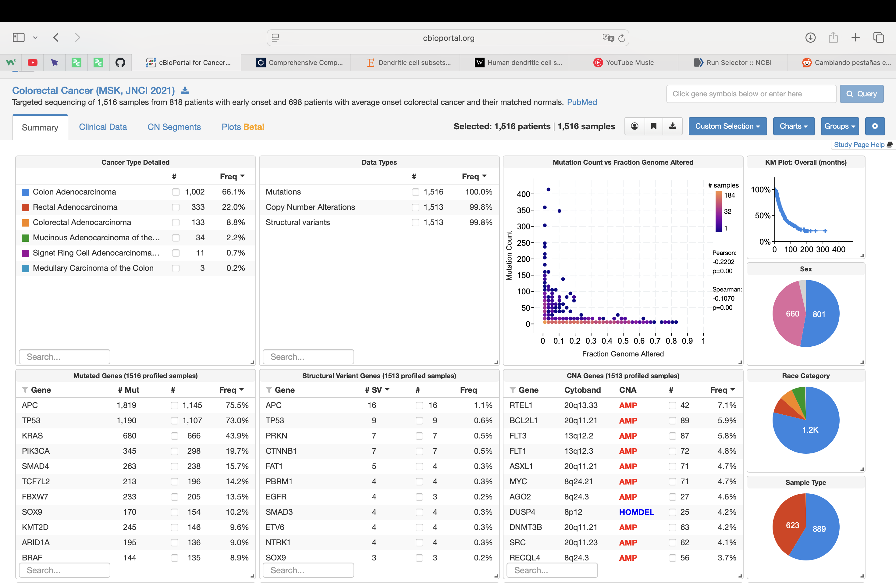
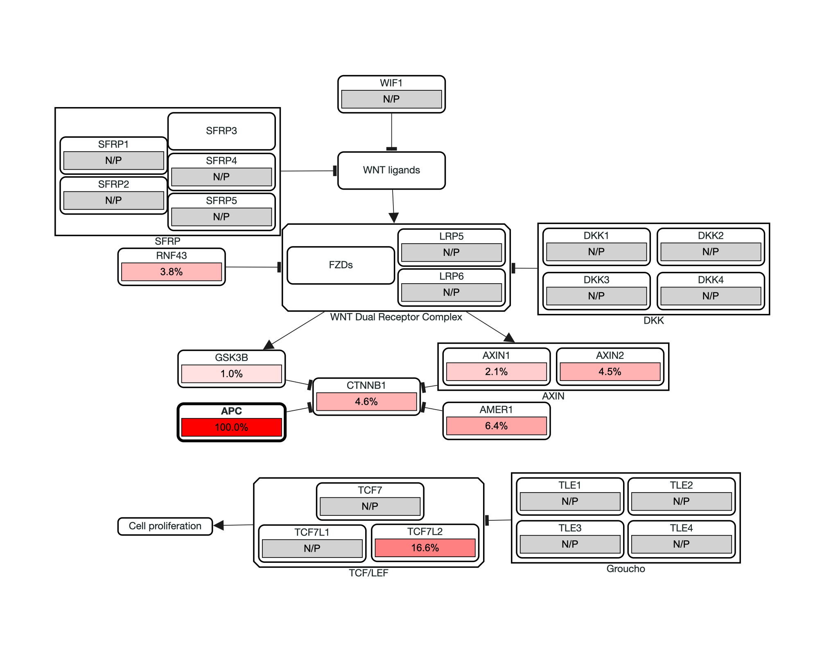
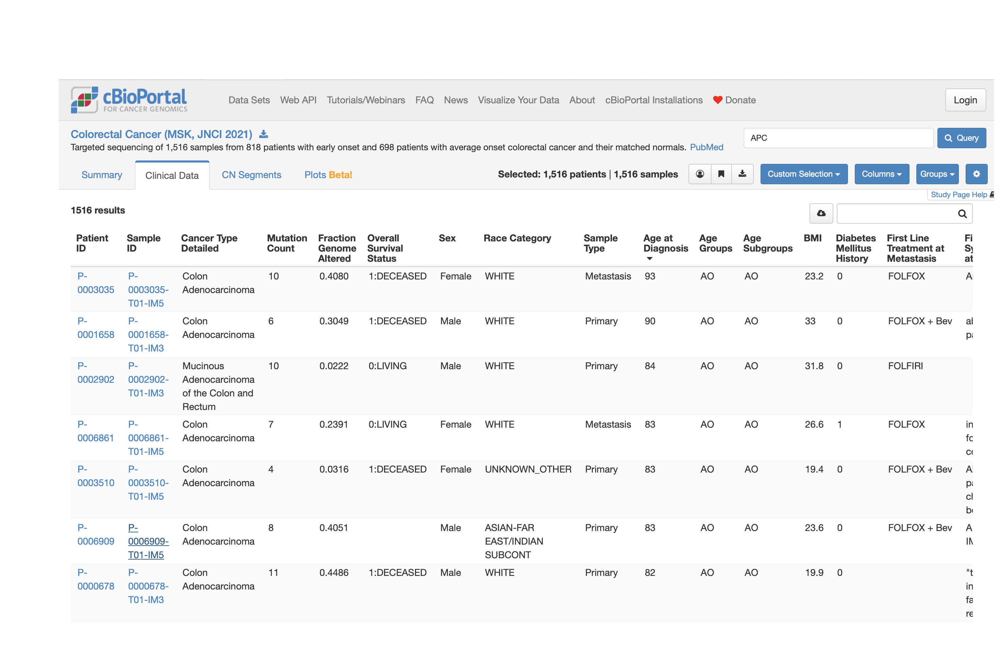
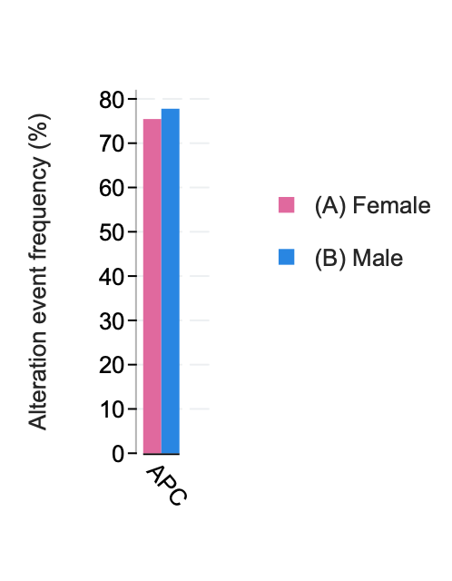
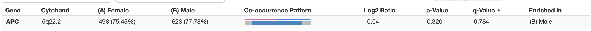
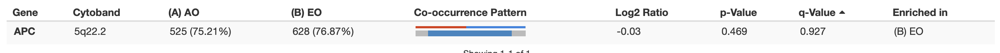

# Tarea Unidad 3 - Sesión 2

**Camilo Cabrera**
**29.10.2025**

-----------------------

## 🎯 Objetivo

Explorar un estudio real disponible en [cBioPortal](https://www.cbioportal.org) para:

1. Analizar alteraciones genéticas en un tipo de cáncer específico,  
2. Filtrar pacientes con una mutación relevante, y  
3. Interpretar la información clínica y genómica obtenida.

---

## 🧩 Parte 1: Selección del estudio (15 min)

1. Ingresa a [https://www.cbioportal.org](https://www.cbioportal.org).  
2. Explora el listado de estudios y selecciona **un tipo de cáncer sólido** (por ejemplo: *Lung adenocarcinoma*, *Pancreatic cancer*, *Breast cancer*, *Colorectal cancer*).  
3. El estudio elegido debe tener **al menos 100 pacientes** y **datos genómicos y clínicos disponibles**.

**Completa la siguiente información:**

- **Nombre del estudio:**  
  
  > Colorectal Cancer (MSK, JNCI 2021)

- **Número total de pacientes:**  
  
  >  1516 pacientes

- **Institución responsable:**  
  
  > Memorial Sloan Kettering Cancer Center

---

## 🧬 Parte 2: Análisis genómico (25 min)

1. Ve a la pestaña **Summary** del estudio.  
2. Localiza la tabla **“Mutated Genes”**.  
3. Identifica los **5 genes con mayor frecuencia de mutación**.

| #   | Gen    | N° de mutaciones | N° de pacientes | Frecuencia (%) |
| --- | ------ | ---------------- | --------------- | -------------- |
| 1   | APC    | 1819             | 1145            | 75.5           |
| 2   | TP53   | 1190             | 1107            | 73.0           |
| 3   | KRAS   | 680              | 666             | 43.9           |
| 4   | PIK3CA | 345              | 298             | 19.7           |
| 5   | SMAD4  | 263              | 238             | 15.7           |

4. Selecciona **uno de esos genes** (ejemplo: *KRAS*, *TP53*, *PIK3CA*) y filtra las muestras (→ **Select Samples**).  
   Observa cómo cambian los gráficos del resumen.

**Responde:**

- ¿Cuántos pacientes presentan esa mutación?  
  
  > 1145 pacientes presentan la mutación

- ¿Qué tipo de mutación es más frecuente (missense, nonsense, frameshift)?  
  
  > Hay 6 mutaciones con mayor frecuencia, donde se incluyen 3 missense, 2 cambios en el marco de lectura (1 ins y 1 del) y finalmente 1 mutación sin sentido.

- ¿Qué vías de señalización aparecen alteradas en la pestaña *Pathways*?  
  
  > Se ve alterada la vía WNT 

---

## 👩‍⚕️ Parte 3: Análisis clínico (15 min)

1. Entra en la pestaña **Clinical Data**.  

2. Examina las variables demográficas:
   
   - Distribución por sexo  
   - Distribución por edad  
   - Distribución por raza (si está disponible)

3. Calcula:
   
   - **Rango de edad (edad máxima − edad mínima):**  
     
     > El rango etario es (93 - 22) 
   
   - **Mediana de edad (usando “Compare Groups → Median”):**  
     
     > Existen 2 grupos de edad. Grupo AO, cuya mediana es 42 años y Grupo EO, cuya mediana es 60 años.

4. **Interpreta los resultados:**
   
   - ¿Existe una predominancia por sexo o edad?  
     
     >  No hay predominancia significativa el comparar edades, ni sexo para la mutación en particular.    
   
   - ¿Qué implicancias podría tener esa distribución para el estudio del cáncer elegido?  
     
     > Al no existir una predominancia por sexo o edad en base a lo observado de la mutación particular. Quiere decir que los estudios relacionados pueden ser transversales ya sea para edad o sexo.

---

## 🧠 Parte 4: Análisis interpretativo (10 min)

Redacta un breve comentario (5–10 líneas) respondiendo:

> ¿Qué relación observas entre las mutaciones más frecuentes y las características clínicas del grupo?  
> ¿Por qué podría ser relevante este gen como biomarcador o diana terapéutica?

_Respuesta:_

```

Las mutaciones en APC y TP53 son altamente prevalentes (>73%) en todos los grupos clínicos analizados,
independientemente de edad o sexo. Esta distribución sugiere que estas alteraciones son eventos tempranos
y necesarios en la oncogénesis colorrectal. El gen APC, en particular, actúa como "guardián" de
la ruta Wnt/β-catenina, ya que, inhibe la vía y su pérdida es prácticamente universal en este tipo de cáncer.
Como biomarcador, su presencia casi ubiquitaria limita su valor discriminatorio.

En contraste, KRAS (43.9%) muestra una frecuencia más selectiva y podría ser un mejor predictor
de respuesta a terapias dirigidas (ej. inhibidores de EGFR). La relevancia terapéutica reside en que
los pacientes con wild-type KRAS responden mejor a anticuerpos anti-EGFR (cetuximab),
mientras que mutantes KRAS se benefician de inhibidores de BRAF o MEK.
Este patrón sugiere que para definir grupos terapéuticos, es más relevante el genotipo de KRAS que la presencia de APC o TP53.

```

---

## 📤 Entrega

- **Formato:** PDF o Markdown (.md) con respuestas y capturas de pantalla.  
- **Tiempo estimado:** 60–75 minutos.  
- **Evaluación sugerida:**

| Criterio                                      | Ponderación |
| --------------------------------------------- | ----------- |
| Selección y descripción del estudio           | 20 %        |
| Análisis genómico (tabla de genes + filtrado) | 30 %        |
| Análisis clínico y rango de edad              | 25 %        |
| Interpretación final                          | 25 %        |

---

## 💡 Recomendaciones

- Incluye al menos **dos capturas de pantalla** (una del panel *Summary* y otra del panel *Clinical Data*).  
- Usa lenguaje claro y conciso en las respuestas.  
- Cita el nombre del estudio tal como aparece en cBioPortal.
