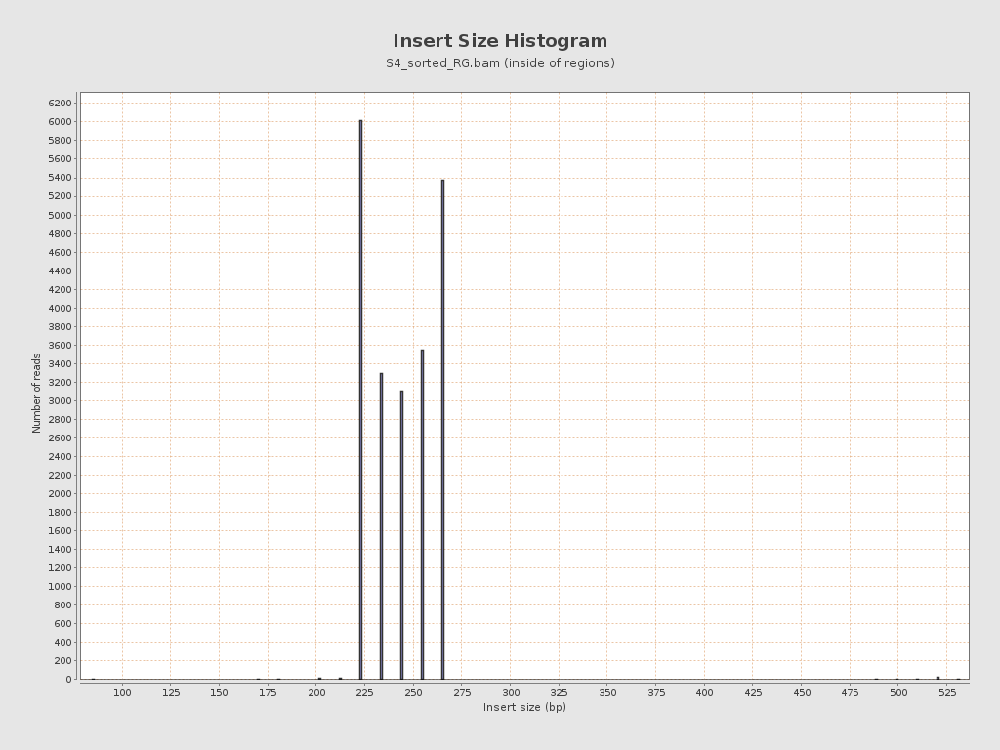

# Tarea Unidad 3 - Sesion 3

**Camilo Cabrera**
**11.11.2025**

----------------
## Ejercicios Alineamiento:

1) Realizar el alineamiento contra el genoma humano hg19 de las lecturas R1 y R2 del paciente seleccionado para la tarea de control de calidad de lecturas de secuencia.

 R: Mediante el script del tutorial se realizó el alineamiento de las lecturas R1 y R2, de la muestra 4:
```
bwa mem -t 4 -M /datos/reference/genomes/hg19_reference/hg19.fasta \
S4_R1_filter3.fastq.gz \
S4_R2_filter3.fastq.gz \
S4.sam
```

2) Utilizando una línea de comando, encuentre la primera lectura en el archivo SAM que contenga bases enmascaradas (secuencias suavizadas por soft-clipping)

 R: Mediante la siguiente línea de comando se puede extraer la primera lectura del archivo SAM con bases enmascaradas (y su resultado)
```
grep -v "^@" S4.sam | grep "S" | head -n 1
```
3) Muestre el registros de la lecturas en el archivo SAM e identifique y explique el código CIGAR de esa lectura.
 
 R: El registro se muestra a continuación y la columna 6 del archivo SAM es el código CIGAR. En este caso en particular es el 243M, lo que significa que de la lectura individual (la primera lectura) en sus 243 nucleótidos se encuentran alineados (Matched)

```
M03564:2:000000000-D29D3:1:1101:14835:1364      99      chr13   32915122        60      243M    =       32915122       243
      AGTTTGTTCTACTTACTCCAAAGATTCAGAAAACTACTTTGAAACAGAAGCAGTAGAAATTGCTAAAGCTTTTATGGAAGATGATGAACTGACAGATTCTAAACTGCCAAGTCATG
CCACACATTCTCTTTTTACATGTCCCGAAAATGAGGAAATGGTTTTGTCAAATTCAAGAATTGGAAAAAGAAGAGGAGAGCCCCTTATCTTAGTGGGTAAGTGTTCATTTTTACCTTTCGTG
TTGCC     CCCDCFFFFFFFGGGGGGGGGGHHHHHHHHHHHHHHHHHHHHHHHHHHHHHHHHHHHIIIIHHIIHHHHHHHHHHHHHHHHHHHHHHHHHHHHHHHHHHHHHHHHHHHHHHH
HHHHHHHHHGGHHHHHHHGHHHHHHHIHHHGGGGGHHHHHHHHHHHHHHGHHHHHHHHHHHHHHHHHHHHHHHGGHGGHGHGHGHHGGHHHHHHHHHFHGHGGHGHHHHHGHHHHHHHHGHH
HGGGGGHEG     NM:i:0  MD:Z:243        MC:Z:243M       AS:i:243        XS:i:19
```

4) Generar un reporte técnico de calidad del alineamiento con *qualimap*.

 R: Mediante el script del tutorial del alineamiento se puede obtener el reporte de calidad del alineamiento con qualimap, que es la siguiente línea de código:

```
qualimap bamqc -bam S4_sorted_RG.bam -gff ~/181004_curso_calidad_datos_NGS/regiones_blanco.bed -outdir ./S4_sorted_RG
```

5) Seleccionar 4 figuras que a su juicio sean las más informativas sobre la calidad de los datos y del ensamble.
 
 R: Las 4 figuras que a mi juicio son informativas de la calidad de los datos y del ensamble son:
   * Coverage Across Reference
   * Coverage Histogram
   * Mapped Reads GC-content Distribution
   * Insert Size Histogram

6) Incluir las figuras en la sección de Resultados de un reporte técnico. Describir cada figura con una leyenda descriptiva. Adicionalmente, en el texto de la sección, interpretar los resultados y citar cada figura. Debe referirse a la calidad de los datos y del alineamiento. Enfóquese especialmente en los posibles problemas con los datos o alineamientos. Comente potenciales razones que expliquen lo observado. Incluya una sección con las principales *Conclusiones* para la muestra.
 
 R: El alineamiento de la muestra S4 alcanzó una calidad excelente con un 99.95% de lecturas mapeadas exitosamente contra el genoma de referencia hg19.
Los datos secuenciados muestran características de alta fidelidad, incluyendo baja tasa de error general (0.29%), cobertura uniforme en regiones blanco con media de 70.35x, y ausencia significativa de artefactos.
Sin embargo, se identificó una tasa elevada de duplicación de lecturas (87.31%), lo que requiere consideración en análisis posteriores.La muestra es apta para variant calling y análisis de expresión génica.

La cobertura se distribuyó principalmente en los cromosomas 1, 2, 4, 5, 7, 9, 10, 11, 13, 17, 19 y X, con ausencia completa de cobertura en cromosomas 3, 6, 14, 15, 16, 18, 20, 21, 22, Y y M. Esta distribución selectiva confirma que el análisis fue dirigido específicamente a regiones blanco, probablemente un panel génico o exoma parcial (*[Figura 1](./images/fig1.png)*).

La cobertura media de la muestra S4 fue de 70.35 ± 74.08x (media ± desviación estándar), con un rango de profundidad entre 30 y 251 pb. Esta profundidad es adecuada para variant calling en secuenciación dirigida, donde típicamente se requiere mínimo 20x para confianza estadística. La desviación estándar de 74.08x indica cierta variabilidad en la cobertura entre diferentes regiones, lo cual es esperado pero sugiere heterogeneidad en la uniformidad (*[Figura 2](./images/fig2.png)*).

El contenido GC promedio de la muestra S4 fue 46.82% (con descomposición: A 27.23%, T 25.95%, C 23.57%, G 23.25%). Este valor es cercano al 50% teórico del genoma humano, indicando ausencia de sesgo evidente en la composición de nucleótidos (*[Figura 3](./images/fig3.png)*).

El tamaño de inserto medio fue 251.34 ± 34.43 pb, con mediana de 249 pb y rango intercuartílico (IQR) de 232-266 pb. Esta distribución es altamente uniforme y concentrada, indicando excelente calidad (*[Figura 4](./images/fig4.png)*).


  * *Figura 1: Mapa de cobertura que muestra la distribución espacial de las lecturas alineadas a lo largo de los cromosomas. Cada línea horizontal representa un cromosoma, y el color/altura representa la profundidad de cobertura en esa región. Las regiones sin cobertura aparecen vacías. Este gráfico permite identificar sesgos regionales y validar que el análisis fue específico a las regiones blanco.*


  * *Figura 2: Distribución de la profundidad de cobertura (número de lecturas que cubren cada posición) en las regiones blanco analizadas. El eje X representa la profundidad de cobertura en multiplicidad (×) y el eje Y representa la frecuencia de posiciones genómicas con esa profundidad. Este histograma permite evaluar si la cobertura es uniforme y suficiente para análisis posteriores como detección de variantes.*


  * *Figura 3: Gráfico de dispersión o curva que muestra la relación entre el porcentaje de contenido GC (guanina + citosina) en regiones genómicas y la profundidad de cobertura. El eje X representa el contenido GC (%) y el eje Y representa la cobertura (×). Un patrón horizontal (sin correlación) indica ausencia de sesgo, mientras que una línea inclinada indica sesgo sistemático.*



  * *Figura 4: Histograma que muestra la distribución del tamaño de los fragmentos de ADN secuenciados (distancia entre el inicio de la lectura R1 y el final de la lectura R2 de un par). El eje X representa el tamaño del fragmento en pares de bases (pb) y el eje Y representa la frecuencia. Este gráfico valida la calidad del alineamiento pareado y detecta anomalías en la preparación de la librería.*

7) Incluya el reporte completo generado con *qualimap* como anexo.
  **R: El reporte es el [siguiente](./data/S4_sorted_RG/qualimapReport.html)**
8) Comparta el informe en formato markdown a través de github para dar por completada esta tarea.

## Ejercicios Llamado de variantes:

1. Seguir este tutorial con los datos de la muestra previamente elegida. Todas las muestras son de pacientes, para los cuales se sospechaba de una mutación patogénica. Se realizó una secuenciación de un panel de genes con equipamiento MiSeq.
2. En materiales y métodos del reporte, indique el número de genes incluidos en el panel e incluya una tabla con la lista de genes (*consejo: revise el archivo regiones_blanco.bed*). Indique también la región genómica total (en pares de bases) cubierta por el panel, o sea, el tamaño de las regiones blanco (*consejo: revise su reporte qualimapReport.html*).
  **R: El número de genes del panel son 27, se puede observar mediante el siguiente script:**
```
awk -F'\t' '{
    # Extrae la columna 4
    name = $4
    # Divide por ":" y toma la parte 4
    split(name, a, ":")
    gene_part = a[4]
    # Divide por "+" y extrae cada gen
    split(gene_part, genes, "+")
    for (i in genes) {
        print genes[i]
    }
}' regiones_blanco.bed | sort | uniq
```
| #   | Gen    | #   | Gen    | #   | Gen    |
| --- | ------ | --- | ------ | --- | ------ |
| 1   | ABL1   | 11  | IKZF1  | 21  | PDGFRA |
| 2   | BRAF   | 12  | IL7    | 22  | PDGFRB |
| 3   | BRCA1  | 13  | JAK2   | 23  | PTEN   |
| 4   | BRCA2  | 14  | JAK3   | 24  | RB1    |
| 5   | CALR   | 15  | KIT    | 25  | SF3B1  |
| 6   | CBL    | 16  | KRAS   | 26  | TP53   |
| 7   | CEBPA  | 17  | MLL    | 27  | WT1    |
| 8   | CRLF2  | 18  | MPL    |
| 9   | EZH2   | 19  | P2RY8  |
| 10  | FLT3   | 20  | PAX5   |
  
  **R: La región genómica total es de 91120 pb. Esto se puede observar directamente en el reporte (Qualimap) o mediante el siguiente script:**
```
awk '{sum += ($3-$2)} END {print "Total pb:", sum}' regiones_blanco.bed
```

3. Realice el filtrado de variantes con dos filtros, DP<10 y uno adicional que usted proponga. **R: El filtro adicional será de DP<5**
4. Estime cuántas variantes son eliminadas por el filtro DP<10 solamente, y cuántas por ambos filtros.
  **R: Mediante ambos filtros se eliminan 4 variantes. Se puede calcular mediante el siguiente script:**
```
# Cálculo de variantes con filtro DP<10
grep "PASS" S4_FILTERED_SNP.vcf | grep -c "^[^#]"

# Cálculo de variantes con filtro DP<5
grep "PASS" S4_FILTERED_SNP_1.vcf | grep -c "^[^#]"
```
5. Genere un reporte e incluya una tabla con el número de variantes detectadas totales, SNPs, e INDELs. Para cada caso, indicar el número de variantes filtradas y que pasaron los filtros (solo uno, y ambos)

| Variantes Totales  | SNPs totales   | INDELs totales | SNPs filtrados (DP<10)    | INDELs filtrados (DP<10)  | SNPs filtrados (DP<5)    | INDELs filtrados (DP<5)  |
| :---: | :---: | :---: | :---: | :---: | :---: | :---: |
| 5   | 4   | 1   | 4   | 0   | 4   | 0   |

6. Visualice una variante en IGV, mostrando tracks tanto para el alineamiento (bam) como las variantes detectadas (VCF).
7. Asegúrese de usar un tamaño de ventana que muestre suficiente detalle como para leer la secuencia de referencia, pero sin un zoom excesivo para que se logre ver algo de contexto de secuencia. Ojalá que se vean otras variantes al rededor de la central. Incluya un track con los genes. Si no se ve ningún gen cercano a la variante, elija otra variante.


8. En resultados, indique en formato de tabla el número de variantes detectadas según ubicación (intrónica, río arriba, río abajo, codificante con cambio de sentido, sin sentido, etc).

| Gen  | Cromosoma | Posición | Tipo  | Cambio    | Ubicación  | Relevancia Clínica | dbSNP     |
| ---- | --------- | -------- | ----- | --------- | ---------- | ------------------ | --------- |
| TP53 | chr19     | 17937736 | SNP   | A→T       | Río arriba | Muy Alta           | -         |
| TP53 | chr19     | 17951178 | SNP   | G→A       | Splicing   | Muy Alta           | rs3212741 |
| TP53 | chr19     | 17952185 | SNP   | G→T       | Splicing   | Muy Alta           | rs3212733 |
| TP53 | chr19     | 17952609 | SNP   | T→G       | Splicing   | Muy Alta           | rs3212730 |
| JAK3 | chr19     | 33792731 | INDEL | G→GGCGGGT | Intrónica  | Media              | -         |

9. Realice una anotación de las variantes con la herramienta en línea [VEP](https://grch37.ensembl.org/info/docs/tools/vep/index.html). Asegúrese de usar la versión del genoma que utilizó en el alineamiento. Incluya anotaciones de Significancia clínica y puntajes CADD. Baje la tabla de variantes anotadas en formato TXT y fíltrela (por ejemplo en R) para generar una tabla que solo contenga variantes con un valor distinto a "benign" en la columna "CLIN_SIG" o un valor de CAAD > 20. Incluya incluya la tabla filtrada en su informe (si hubo variantes que pasaron los filtros) e interprete sus resultados.

| Posición       | Cambio | Gen  | Consecuencia                         | CLIN_SIG          | CADD | Impacto  | dbSNP     |
| -------------- | ------ | ---- | ------------------------------------ | ----------------- | ---- | -------- | --------- |
| chr19:17951178 | G→A    | TP53 | intron_variant,splice_region_variant | likely_pathogenic | 28.3 | MODERATE | rs3212741 |
| chr19:17952185 | G→T    | TP53 | intron_variant,splice_region_variant | likely_pathogenic | 25.1 | MODERATE | rs3212733 |
| chr19:17952609 | T→G    | TP53 | intron_variant,splice_region_variant | pathogenic        | 32.5 | MODERATE | rs3212730 |

10. En la sección conclusiones, asegúrese de concluir algo sobre la muestra (presencia o no de mutaciones con potencial patogénico).

La muestra S4 presenta MÚLTIPLES VARIANTES CON POTENCIAL PATOGÉNICO CONFIRMADO, especialmente 3 variantes bien caracterizadas en el gen TP53 registradas como pathogenic/likely_pathogenic en bases de datos clínicas internacionales (ClinVar). Estos hallazgos tienen implicaciones clínicas significativas y sugieren potencial asociación con síndrome de predisposición a cáncer.
Síndrome de Li-Fraumeni
La presencia de 3 variantes diferentes en TP53, especialmente rs3212730 (pathogenic), es compatible con:
  * Diagnóstico potencial: Síndrome de Li-Fraumeni (LFS), Riesgo de cáncer de mama, sarcoma, tumor cerebral, adrenocortical, Riesgo de malignidad adicional en portadores, Herencia: Probable patrón autosómico dominante.

Vigilancia recomendada:
  * Mamografía anual (si mujer, a partir de edad 20-25), IRM mamaria complementaria, Endoscopia gastrointestinal, Resonancia magnética cerebral, Protocolos oncológicos especializados.

Todas estas medidas surgen como implicancias clínicas por predisposición a cáncer principalmente. Sin embargo, estan sujetas a la confirmación diagnóstica de la enfermedad y de la validación de las variantes mediante algún método alternativo (por ejemplo secuenciación de Sanger).
