# Tarea Unidad 3 - Sesion 4

**Camilo Cabrera 21.11.2025**

---------------------------------

## Llamado de variantes en muestra tumoral mediante CLC Genomics

La identificación de variantes genómicas tumorales es clave para comprender la biología del cáncer y sus implicaciones clínicas. El software con que se trabajó este tutorial permite el análisis de datos de secuenciación masiva (NGS), utilizando herramientas de alineamiento, detección y anotación de variantes. 

Por lo que, se presentará la resolución del tutorial 1 del Software CLC: "Identification of Variants in a Tumor Sample". Para ello se comenzará con la descarga ([Example_data_tumor_25.zip](https://resources.qiagenbioinformatics.com/testdata/Example_data_tumor_25.zip)) e importación de los datos, para este tutorial sólo se utilizará una fracción del cromosoma 5, en la importación se obtendrán 2 elementos, `target_regions_chr5` y `tumor_reads_chr5`. 

## Identificación de variantes

Una vez lista la importación se realizará el análisis mediante un template de workflow, mediante la herramienta `Identify Variants (WES)`, para ello hay que seleccionar el input de lectura y la región target.

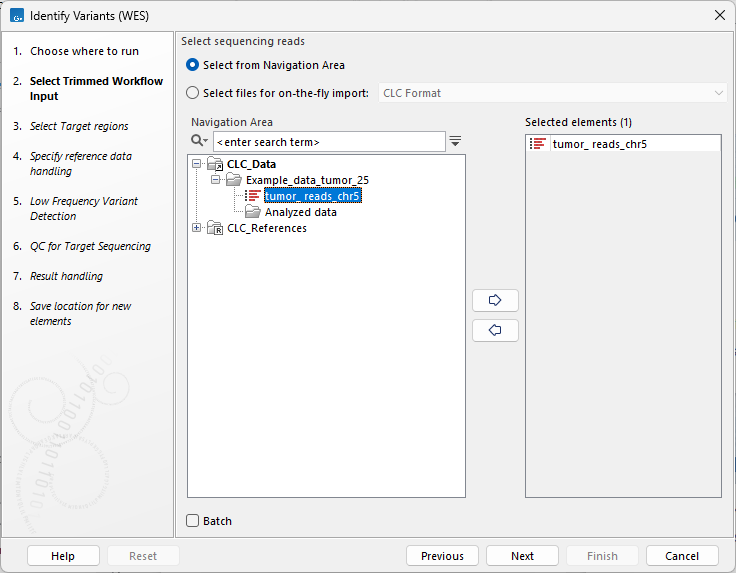

*Figura 1: Selección de input de lecturas de secuenciación en `Identify Variants (WES)` del software CLC Genomics*

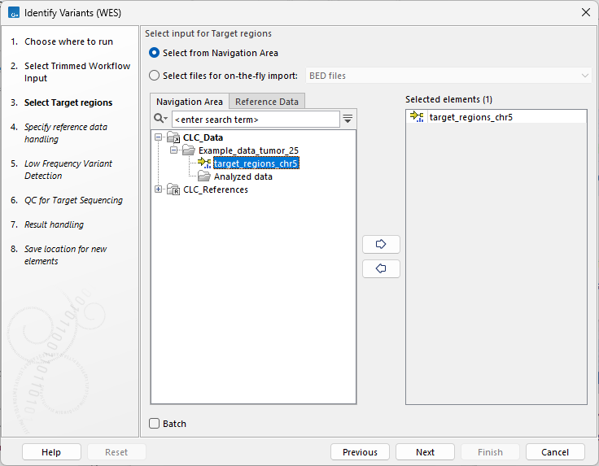

*Figura 2: Selección de región target de secuenciación en `Identify Variants (WES)` del software CLC Genomics*

Luego se debe de establecer el genoma de referencia para la identificación de variantes, en este caso sera `hg19`. Una vez establecida la referencia es necesario de establecer los parámetros para la detección de variantes que en este caso dado el tutorial se busca detectar variantes somáticas de baja frecuencia, y se establece un umbral de frecuencia mínima de un 5%. A continuación, para el QC se debe establecer un umbral de cobertura para la región target de 10

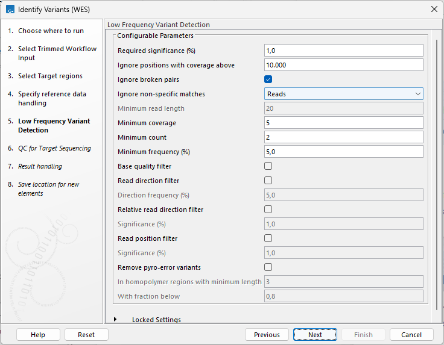

*Figura 3: Selección de parámetros relevantes para la detección de variantes somáticas de baja frecuencia en `Identify Variants (WES)` del software CLC Genomics*

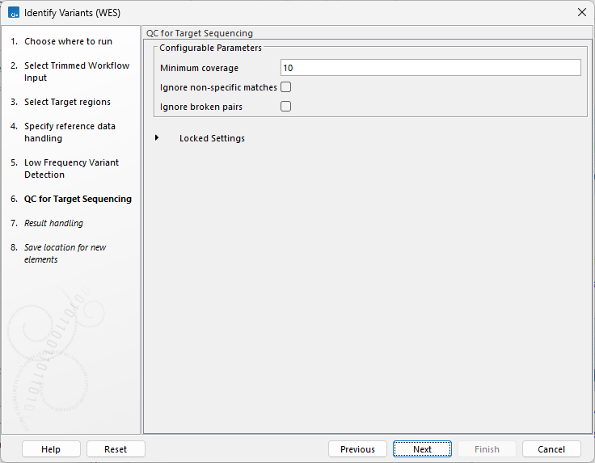

*Figura 4: Selección de umbral de cobertura para QC target region en `Identify Variants (WES)` del software CLC Genomics*

Tras definir los parámetros para la identificación de variantes se debe definir una carpeta para la obtención de los resultados, que en este caso será por defecto en la carpeta de los datos `Example_data_tumor_25/Analyzed_data`

## Reporte de calidad para regiones target

Para analizar el reporte de calidad se debe de observar el archivo generado `Target_region_coverage_report-tumor_ reads_chr5`, que nos guiará para determinar las 3 preguntas principales planteadas en el tutorial:

>¿La cobertura promedio en las regiones objetivo es suficiente?

>¿La especifidad de las lecturas mapeadas hacia la región objetivo está en los rangos esperados?

>¿Están los objetivos específicos suficientemente cubiertos?

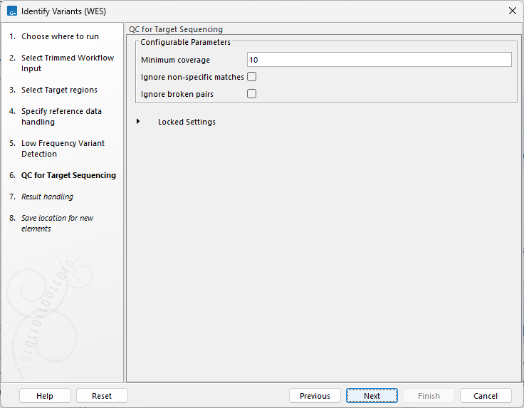

*Figura 5: Resumen del reporte de calidad del análisis en `Identify Variants (WES)` del software CLC Genomics*

Por lo tanto, según lo observado podemos responder la primera pregunta **`¿La cobertura promedio en las regiones objetivo es suficiente?`**. 

En este caso la cobertura mínima establecida fue de **10**, por lo que, se esperaría observar un **valor medio de cobertura >10** y la **cobertura promedio obtenida es de 22,5**. Además, al analizar el porcentaje de posiciones dentro de la región objetivo que cumplen con la cobertura mínima de 10, se ve que hay un 82,6% del total. Por lo que, se puede concluir que hay una cobertura adecuada para la mayoría de las lecturas, sin embargo, si es que hubiesen genes de importancia en las regiones que no cumplen con una profundidad adecuada se podría recomendar hacer una revisión manual para identificar aquellas posibles variantes de importancia clínica.

La segunda pregunta se puede responder con el siguiente apartado del reporte de calidad, que se denomina `Targeted region overview`.

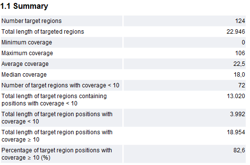

*Figura 6: Tabla de reporte de calidad "Targeted region overview" en `Identify Variants (WES)` del software CLC Genomics*

Con esta información se puede responder la segunda pregunta **`¿La especifidad de las lecturas mapeadas hacia la región objetivo está en los rangos esperados?`**

Para concluir la especificidad del análisis debemos de recordar que se trata de un ejemplo de secuenciación de exoma completo (WES), para ello se debe considerar que la especificidad puede variar dependiendo del kit que se use para realizar el enriquecimiento previo a la secuenciación. En este caso, si se hubiese usado un array el mínimo de especificidad sería de aproximadamente un 50%. Dicho esto, al observar la tabla, se puede observar que la especificidad de lecturas (y de bases) es inferior a un 50%. Esto puede ser explicado ya que, en el ejemplo sólo se utiliza una pequeña región del genoma, por lo que ciertas lecturas no están siendo mapeadas en su región correspondiente del genoma.

La tercera pregunta **`¿Están los objetivos específicos suficientemente cubiertos?`**, se responde mediante la siguiente tabla:

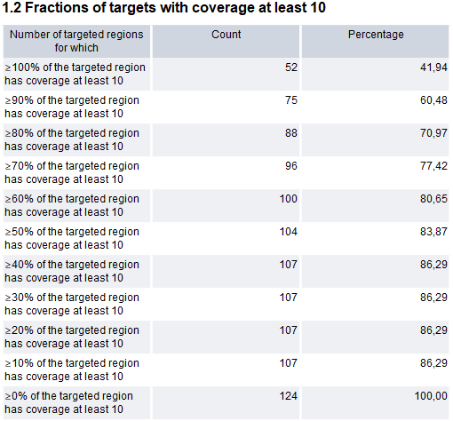

*Figura 7: Cobertura de la región objetivo en `Identify Variants (WES)` del software CLC Genomics*

Esta es la pregunta más importante a la hora de sacar conclusiones debido a nos da en claro si es que hay una cobertura suficiente en los objetivos mapeados, si no fuese el caso, debería de realizarse nuevamente la secuenciación o si hay regiones faltantes secuenciarlas mediante método Sanger. Para el caso del tutorial poseemos un valor para la cobertura de al menos un 80% de la región objetivo de 70,97%, lo que, al complementarlo con el rango de especificidad esperado mencionado previamente (50%), se puede concluir que **hay una cobertura adecuada de los objetivos específicos**

## Cobertura particular de un gen en las lecturas

En este caso para poder analizar la cobertura de un objetivo particular (sea cual sea el gen), se puede usar la interfaz integrada mediante el genome browser, que nos ofrece información importante para hacer el análisis. En este caso en azul se puede observar el genoma de referencia, en verde los transcritos de la referencia (mRNA), en amarillo las secuencias de DNA codificante, en azul claro se ven las lecturas de la secuenciación del tutorial y finalmente en rojo se ven las variantes somáticas.

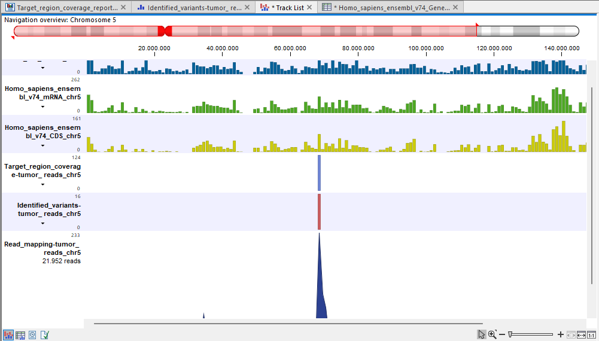

*Figura 8: Genome browser del software CLC Genomics, permite la observarción de distintos tracks (gene, regiones particulares, genomas de referencia, etc)*

La visualización de los datos constituye un paso fundamental para asegurar la calidad del mapeo genómico. Mediante esta herramienta, se valida tanto la ubicación exacta de las variantes (zonas génicas/exónicas) como la suficiente cobertura de las regiones de interés. La confirmación de una adecuada cobertura de estas áreas es un indicador directo de la solidez de los resultados, fortaleciendo la fiabilidad del análisis de variantes subsiguiente. Con la visualización desglosada y con el fin de reproducir el tutorial con un gen distinto se seleccionó de la región secuenciada el gen `CDK7` que **codifica para una ciclina quinasa** lo que por mutaciones puede llegar a la generación de cáncer ya que tiene un importante rol regulador del ciclo celular. La desregulación de CDK7 se ha visto descrito en distintos tipos de cánceres como [cáncer de mama](https://biosignaling.biomedcentral.com/articles/10.1186/s12964-024-01577-y), de próstata, de ovario, entre otros.

Al analizar la cobertura específica para el gen CDK7 se puede ver que dentro de la región particular al filtrar la tabla mediante el nombre del gen, se puede observar que para las regiones correspondientes al gen hay una cobertura mayor al 80% en la mayoría de estas (8 de 12), por lo tanto el gen particular tiene una adecuada cobertura.

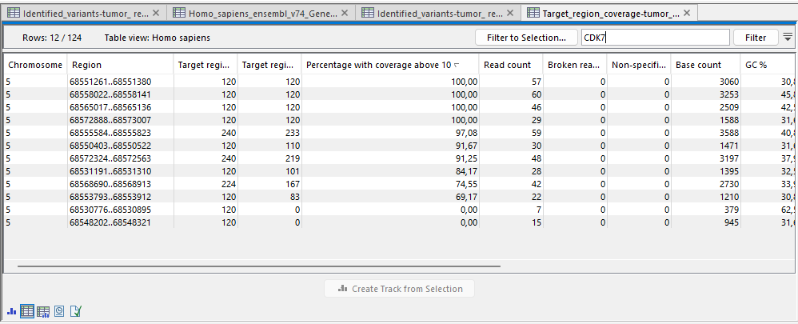

*Figura 9: Cobertura de regiones del gen CDK7*

## Identificación de falsos positivos

Al realizar el análisis de variantes, y determinar que genes hay en dentro de la región del tutorial, es importante descartar variantes de falsos positivos. Por ello primero se observan el total de 16 variantes obtenido del análisis previo.

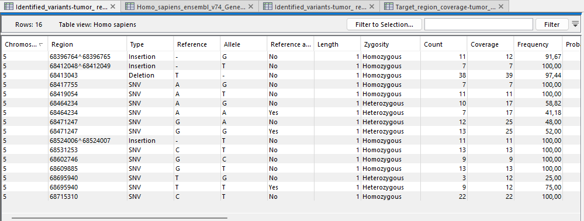

*Figura 10: Variantes detectadas mediante la herramienta `Identify Variants (WES)` del software CLC Genomics*

El primer filtro aplicado para estas variantes es eliminar aquellas no que poseen alelo de referencia, mediante los filtros se puede ver que quedan sólo 13 de las 16.

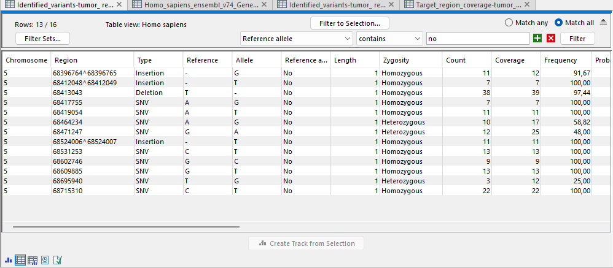

*Figura 11: Filtro de variantes que poseen no alelo de referencia*

El siguiente punto importante para filtrar es la frecuencia, donde se buscan variantes de baja frecuencia preferentemente. En estos casos se puede cometer errores debido a que si la variante se encuentra en muy baja frecuencia puede deberse a errores en la secuenciación, por lo que, se debe tener cuidado dentro de esta selección. Para motivos del tutorial se puede hacer el filtro en 50% por ejemplo y quedarían 2 variantes restantes del filtro. La variante de menor frecuencias (25%) posee una cobertura apenas por sobre el mínimo de 10 y con sólo 3 lecturas, por lo que, ésta variante no es la más adecuada para concluir (puede ser un error en la secuenciación). En el caso de la segunda variante más baja de un 48% de frecuencia posee una cobertura de 25, con un conteo de 12, por lo que es más probable que sea una variante propiamente tal. Con motivos del tutorial, se usarán ambas variantes **5:68695940 T>G** y **5:68471247 G>A** para el análisis de relevancia clínica y de esta forma tener más posibilidades de tener hallazgos importantes. 

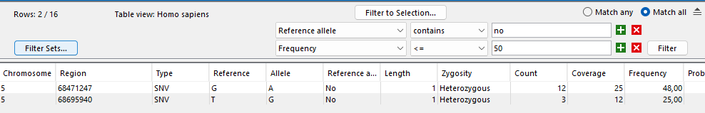

*Figura 12: Filtro de variantes de frecuencia menor a un 50%*

Al analizar las variantes mediante la herramienta gnomAD, la variante `5:68695940 T>G` se trata de una variante missense, lo que puede llegar a tener un efecto, sin embargo tiene alta frecuencia en gnomAD lo que da el indicio de que es probable que sea benigna la variante. 

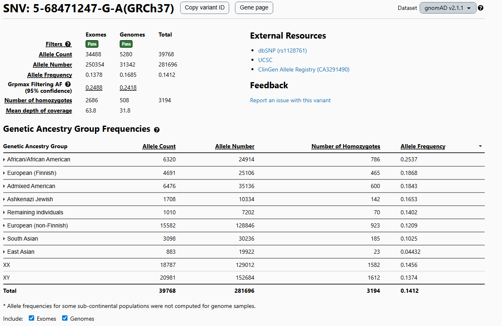

*Figura 13: Búsqueda de la variante `5:68695940 T>G` en base de datos gnomAD*

> Allele Frequency (Total) = 0.2870 (28.70%).
> 
> Casi el 30% de los alelos en la población general tienen esta variante. Incluso en población "South Asian" llega al 36%
> 
> Criterio AMP/ASCO/CAP sería BA1 (Stand-alone Benign). Frecuencia alélica > 5% en una base de datos de control poblacional (gnomAD).
> 
> **Conclusión: Es benigna. Es un polimorfismo común. No tiene rol en la predisposición al cáncer ni como driver oncogénico.**

Al analizar las variantes mediante la herramienta gnomAD, la variante `5:68471247 G>A` se trata de una variante sinonima y además, tiene alta frecuencia en gnomAD lo que da el indicio de que es altamente probable que sea benigna la variante. 

*Figura 14: Búsqueda de la variante `5:68471247 G>A` en base de datos gnomAD*

> Allele Frequency (Total) = 0.1412 (14.12%).

> Presente en más del 14% de la población global.

> Criterio AMP/ASCO/CAP aplicado: BA1 (Stand-alone Benign).

> **Conclusión: Es benigna. Polimorfismo común sin impacto clínico.**

## Conclusiones
