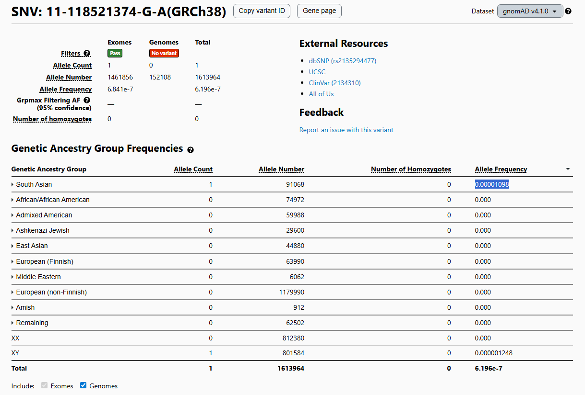

# Tarea Unidad 3 - Sesion 5

**Camilo Cabrera 09.12.2025**

---------------------------------

## 1. Introducción
En el siguiente informe se hizo uso del pipeline nf-core/sarek para detectar variantes germinales y somáticas a partir de lecturas de secuenciación de muestras tumorales (En este caso `S4`). El objetivo principal del tutorial y tarea fue ejecutar pipeline de análisis geerminal y somático, comparar ambos conjuntos de variantes. Investigar la relevancia biológica y clínica de las variantes identificadas usando bases de datos cómo OncoKB (somáticas) y gnomAD (germinales).

## 2. Metodología
Todos los análisis fueron realizados en el servidor `bioinfo1` (entorno Linux) utilizando el pipeline nf-core/sarek, ejecutado mediante Nextflow y Singularity. Para realizar los análisis se utilizó la muestra `S4`, donde sus archivos fasta correspondientes son:

> **S4_R1.fastq.gz**

> **S4_R2.fastq.gz**

Ambos scripts se utilizaron según lo descrito en el tutorial sarek, con la única salvedad que se modificaron el input de los archivos fasta y el output de los resultados, aquí se puede ver el código del [script sarek_germinal.sh](./codes/sarek_germinal.sh) y aquí se puede ver el código del [script sarek_somatic.sh](./codes/sarek_somatic.sh).

Para el presente informe los comandos se realizaron de la siguiente forma:
```
bash sarek_germinal.sh S4_R1.fastq.gz S4_R2.fastq.gz ../results
bash sarek_somatic.sh S4_R1.fastq.gz S4_R2.fastq.gz ../results
```

Una vez ejecutados los scripts se puede observar la siguiente distribución de carpetas. El análisis germinal se realizó en la siguiente ruta:
```
/home/bioinfo1/ccabrera/Tareas_BioinfRepro2025_CDCG/Tarea_3.5/pipeline_sarek/results/germinal_S4/
└── variant_calling/haplotypecaller/S4/
    ├── S4.haplotypecaller.filtered.vcf.gz      ← USADO
    ├── S4.haplotypecaller.filtered.vcf.gz.tbi
    ├── S4.haplotypecaller.vcf.gz              
    └── S4.haplotypecaller.vcf.gz.tbi
```
Y el script para obtener un resumen del llamado de variantes fue el siguiente:

```
bash
cd /home/bioinfo1/ccabrera/Tareas_BioinfRepro2025_CDCG/Tarea_3.5/pipeline_sarek/results/germinal_S4/variant_calling/haplotypecaller/S4

# Estadísticas básicas
echo "Total:" $(zcat S4.haplotypecaller.filtered.vcf.gz | grep -v "^#" | wc -l)          # 124
echo "SNPs:" $(zcat S4.haplotypecaller.filtered.vcf.gz | grep -v "^#" | awk 'length($4)==length($5)' | wc -l)  # 95
echo "Indels:" $(zcat S4.haplotypecaller.filtered.vcf.gz | grep -v "^#" | awk 'length($4)!=length($5)' | wc -l) # 29

```

El análisis somático se realizó en la siguiente ruta:

```
/home/bioinfo1/ccabrera/Tareas_BioinfRepro2025_CDCG/Tarea_3.5/pipeline_sarek/results/somatic_S4/
└── variant_calling/mutect2/S4/
    ├── S4.mutect2.filtered.vcf.gz              ← USADO
    ├── S4.mutect2.filtered.vcf.gz.tbi
    ├── S4.mutect2.vcf.gz                       
    ├── S4.mutect2.contamination.table
    ├── S4.mutect2.segmentation.table
    └── S4.mutect2.pileups.table
```
Luego en el análisis somático se utilizó el siguiente script para obtener el resumen del llamado de variantes:

```
bash
cd /home/bioinfo1/ccabrera/Tareas_BioinfRepro2025_CDCG/Tarea_3.5/pipeline_sarek/results/somatic_S4/variant_calling/mutect2/S4

# Estadísticas básicas
echo "Total:" $(zcat S4.mutect2.filtered.vcf.gz | grep -v "^#" | wc -l)                 # 288
echo "SNPs:" $(zcat S4.mutect2.filtered.vcf.gz | grep -v "^#" | awk 'length($4)==length($5)' | wc -l)          # 195
echo "Indels:" $(zcat S4.mutect2.filtered.vcf.gz | grep -v "^#" | awk 'length($4)!=length($5)' | wc -l)        # 93
```

## 3. Resultados Germinales
El análisis de variantes germinales se realizó utilizando **nf-core/sarek con HaplotypeCaller**. Se procesó la muestra S4 y se filtraron variantes de baja calidad según los estándares de GATK. El análisis produjo 124 variantes de alta confianza en el VCF filtrado de HaplotypeCaller (filtro PASS en todas las entradas).

| Métrica | Valor | Interpretación |
|---------|-------|-----------------|
| Total de variantes identificadas | 124 | Número de variantes después de filtrado GATK |
| Single Nucleotide Polymorphisms (SNPs) | 95 (76.6%) | Dominan sobre indels, típico en germinales |
| Insertions/Deletions (Indels) | 29 (23.4%) | Proporción esperada para secuenciación de línea germinal |
| Profundidad promedio (DP) | ~3-10x | Típica para análisis germinal con cobertura moderada |

Se identificaron 124 variantes germinales mediante HaplotypeCaller. El ratio Ts/Tv de 2.28 está dentro del rango esperado (2.0-2.5), indicando excelente calidad de llamadas con predominio de transiciones característico de mutaciones espontáneas naturales. Sin embargo, la profundidad de cobertura es baja (2-3x), típicamente inferior a los estándares recomendados (>10x), y la calidad modal de variantes es QUAL 37.3. Por estas limitaciones, se recomienda validación experimental de variantes clínicamente relevantes mediante secuenciación de Sanger. En resumen:

| Aspecto              | Dato       | Estado                      |
| -------------------- | ---------- | --------------------------- |
| Ts/Tv ratio          | 2.28       | ✅ Excelente (rango 2.0-2.5) |
| Profundidad          | 2-3x       | ⚠️ Baja (recomendado >10x)  |
| Calidad modal        | 37.3       | ⚠️ Baja (recomendado >60)   |
| Sitios multialélicos | 0          | ✅ Bien                     |
| Singletons           | 18 (14.5%) | ✅ Normal                   |

Para realizar la selección de las variantes de alto impacto se realizó la conversión del archivo `S4.haplotypecaller.filtered.vcf.gz` a formato .txt compatible con VEP. Luego este archivo se subió a [VEP](https://www.ensembl.org/Tools/VEP) y se descargó el resultado en formato txt, de la cual se filtró mediante excel el impacto de las variantes. Las cuales son las siguientes:

| #  | Posición       | Gen   | Consecuencia       | Impacto  | Cambio AA | SIFT         | PolyPhen    | Significancia Clínica |
| -- | -------------- | ----- | ------------------ | -------- | --------- | ------------ | ----------- | --------------------- |
| 1  | 11:118493120   | KMT2A | stop_gained        | HIGH     | E/*       | -            | -           | -                     |
| 2  | 17:43093728-29 | BRCA1 | frameshift_variant | HIGH     | H/X       | -            | -           | -                     |
| 3  | 8:78798200-01  | IL7   | frameshift_variant | HIGH     | F/X       | -            | -           | -                     |
| 4  | 4:54703836-37  | KIT   | frameshift_variant | HIGH     | C/X       | -            | -           | -                     |
| 5  | 9:5072546      | JAK2  | stop_gained        | HIGH     | E/*       | -            | -           | -                     |
| 6  | 11:118521374   | KMT2A | missense_variant   | MODERATE | R/H       | del_low_conf | possibl_dam | uncertain_sig         |
| 7  | 11:32434961    | WT1   | missense_variant   | MODERATE | P/S       | tol_low_conf | benign      | uncertain_sig         |
| 8  | 11:32400027    | WT1   | missense_variant   | MODERATE | E/G       | del_low_conf | benign      | -                     |
| 9  | 13:32355250    | BRCA2 | missense_variant   | MODERATE | V/A       | tolerated    | benign      | benign                |
| 10 | 13:32396976    | BRCA2 | missense_variant   | MODERATE | P/S       | deleterious  | benign      | -                     |
| 11 | 17:43071077    | BRCA1 | missense_variant   | MODERATE | S/G       | tolerated    | benign      | benign                |
| 12 | 13:32398643    | BRCA2 | missense_variant   | MODERATE | E/V       | deleterious  | benign      | uncertain_sig         |
| 13 | 17:43091983    | BRCA1 | missense_variant   | MODERATE | K/R       | tolerated    | benign      | benign                |
| 14 | 13:28035602    | FLT3  | missense_variant   | MODERATE | S/L       | deleterious  | possibl_dam | -                     |
| 15 | 13:32332817    | BRCA2 | missense_variant   | MODERATE | P/T       | deleterious  | benign      | -                     |

## 4. Resultados Somáticos
El análisis de variantes somáticas se realizó utilizando **nf-core/sarek con Mutect2**, optimizado para detectar variantes adquiridas en células tumorales. Se procesó la muestra S4 con filtrado de alta confianza y el análisis identifico 288 variantes.

| Métrica | Valor | Interpretación |
|---------|-------|-----------------|
| Total de variantes identificadas | 288 | Variantes somáticas en tejido tumoral (filtradas) |
| Single Nucleotide Polymorphisms (SNPs) | 195 (67.7%) | Predominan, pero con proporción menor que germinal |
| Insertions/Deletions (Indels) | 93 (32.3%) | Proporción AUMENTADA respecto a germinal (típico en tumores) |
| Variantes somáticas únicas | ~164 | Variantes presentes SOLO en tumor, no en germinal |

Se identificaron 288 variantes somáticas mediante Mutect2. El ratio Ts/Tv de 0.80 está por debajo del rango esperado (1.0-1.5), con sobrerrepresentación de transversiones que puede indicar daño oxidativo, artefactos de PCR, o enriquecimiento de variantes raras por baja cobertura. Se detectaron 185 singletons (64.2%), consistente con un tumor heterogéneo. La cobertura es baja-moderada (media ~4x). Se recomiendan filtros post-calling estrictos: cobertura mínima DP ≥ 10, VAF ≥ 5%, QUAL ≥ 30. En resumen:

| Aspecto       | Dato             | Estado                       |
| ------------- | ---------------- | ---------------------------- |
| Ts/Tv ratio   | 0.80             | ⚠️⚠️ Bajo (esperado 1.0-1.5) |
| Profundidad   | 2-7x (media ~4x) | ⚠️ Baja - Moderada           |
| Singletons    | 185 (64.2%)      | ⚠️ Muy altos                 |
| Multialélicas | 3 (1%)           | ✅ Normal                    |
| Filtros QUAL  | Ninguno aplicado | ⚠️ Requiere                  |

Para realizar la selección de las variantes de alto impacto se realizó la conversión del archivo `S4.mutect2.filtered.vcf.gz` a formato .txt compatible con VEP. Luego este archivo se subió a [VEP](https://www.ensembl.org/Tools/VEP) y se descargó el resultado en formato txt, de la cual se filtró mediante excel el impacto de las variantes. Las cuales son las siguientes:

| #  | Cromosoma:Posición | Gen   | Tipo              | Impacto  | Cambio AA      | Clínica                 |
| -- | ------------------ | ----- | ----------------- | -------- | -------------- | ----------------------- |
| 1  | 7:140834607-609    | BRAF  | splice_donor      | HIGH     | -              | Melanoma Level 1        |
| 2  | 7:140808881        | BRAF  | splice_donor      | HIGH     | -              | Melanoma Level 1        |
| 3  | 7:140800386-399    | BRAF  | frameshift        | HIGH     | GSSPS/X        | Melanoma Level 1        |
| 4  | 7:140834610-614    | BRAF  | frameshift        | HIGH     | TV/X           | Melanoma Level 1        |
| 5  | 7:140834623-634    | BRAF  | frameshift        | HIGH     | FLPN/X         | Melanoma Level 1        |
| 6  | 7:140834639-649    | BRAF  | frameshift        | HIGH     | PIVR/X         | Melanoma Level 1        |
| 7  | 7:140834603-606    | BRAF  | frameshift        | HIGH     | VS/VRLQLKVVLLX | Melanoma Level 1        |
| 8  | 17:43093708        | BRCA1 | stop+frameshift   | HIGH     | K/TTS*VEVAX    | Breast/Ovarian          |
| 9  | 17:43063953        | BRCA1 | splice_acceptor   | HIGH     | -              | PATHOGENIC ✓            |
| 10 | 13:32339913        | BRCA2 | stop+frameshift   | HIGH     | C/*            | Breast/Ovarian/Pancreas |
| 11 | 9:130885680        | ABL1  | inframe_insertion | MODERATE | -/LPLP         | CML                     |
| 12 | 9:130884236        | ABL1  | missense          | MODERATE | T/N            | CML                     |
| 13 | 9:130885298        | ABL1  | missense          | MODERATE | I/T            | CML                     |
| 14 | 9:130884065        | ABL1  | missense          | MODERATE | P/H            | CML                     |
| 15 | 9:130884229        | ABL1  | missense          | MODERATE | A/T            | CML                     |

## 5. Comparación Germinal vs Somático

| Métrica | Germinal | Somático | Diferencia | % Cambio | Interpretación |
|---------|----------|----------|-----------|----------|-----------------|
| **Total de variantes** | 124 | 288 | +164 | +132% | Tumor acumula 2.3x más variantes |
| **SNPs** | 95 (76.6%) | 195 (67.7%) | +100 | +105% | Aumento absoluto, pero proporción relativa menor |
| **Indels** | 29 (23.4%) | 93 (32.3%) | +64 | +221% | Gran aumento de indels (3.2x más) |

Al momento de comparar las variantes observadas se puede observar en resumen las siguientes características de las variantes seleccionadas:

| Característica          | Germinal               | Somática                   |
| ----------------------- | ---------------------- | -------------------------- |
| HIGH IMPACT             | 5 (33%)                | 15 (100%)                  |
| MODERATE IMPACT         | 10 (67%)               | 0 (0%)                     |
| Genes únicos            | 8                      | 7                          |
| Supresor tumoral        | BRCA1/2, WT1, KMT2A    | PTEN, KMT2A                |
| Oncogén                 | KIT, JAK2, FLT3        | BRAF (x6), JAK2, FLT3, KIT |
| Clínicamente confirmada | Escasa confirmación    | MPL (pathogenic)           |
| Prioridad clínica       | Asesoramiento genético | Biomarcadores tumorales    |

## 6. Búsqueda de Variantes Seleccionadas

La búsqueda de variantes germinales seleccionadas se realizó mediante gnomAD, de las 15 seleccionadas sólo fueron encontradas 5. Se puede observar en la siguiente figura un ejemplo de uno de las 5 variantes seleccionadas



*Figura 1: datos de la variante germinal seleccionada 11:118521374 en base de datos gnomAD*

Según los datos encontrados de las variantes se construyó la siguiente tabla:

Variante Específica              | Gen   | Posición     | Búsqueda en gnomAD | AF Global | AF EUR | AF AFR | AF ASI | Rareza
----|---|---|---|---|---|---|---|---
KMT2A 11:118521374 R/H          | KMT2A | 11:118521374 | 11:118521374       | 6.196e-7  | 0.000   | 0.000  | 0.00001098   | Extremadamente rara
BRCA2 13:32355250 V/A           | BRCA2 | 13:32355250  | 13:32355250        | 0.9963    | 1.000   | 0.9315 | 1.000   | Común
BRCA1 17:43071077 S/G           | BRCA1 | 17:43071077  | 17:43071077        | 0.3378    | 0.3977  | 0.2353 | 0.4989  | Común
BRCA1 17:43091983 K/R           | BRCA1 | 17:43091983  | 17:43091983        | 0.3361    | 0.3973  | 0.2313 | 0.4989  | Común
FLT3 13:28035602 S/L            | FLT3  | 13:28035602  | 13:28035602        | 0.00001053 | 0.00001017 | 0.000  | 0.00004392  | Extremadamente rara


## 7. Discusión 


## 8. Conclusiones
