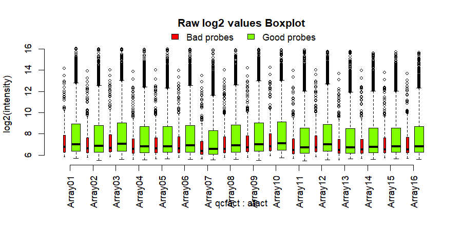
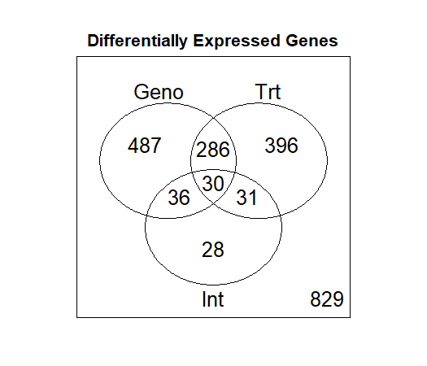

# Tarea Unidad 4 - Sesion 1

**Camilo Cabrera 09.12.2025**

---------------------------------
## Preparación de los directorios y archivos a utlilizar

La tarea fue ejecutada mediante R utilizando el script [`DE-UNIX.R`](./code/DE-UNIX.R) con algunas modificaciones relacionadas a la tarea. El orden de las carpetas será el siguiente:

```R
/Tareas_BioinfRepro2025_CDCG/
└── Tarea_4.1/
    ├── code/
    ├── results/           
    └── Ejercicios_tarea_4.1.md
 ```
Primero, para tarea se debe de trabajar con 5000 lecturas aleatorias del archivo total `Illum_data.txt` del total ~25000 lecturas. Para ello se debe de generar mediante R una semilla y luego exportar la tabla en formato texto:

```R
Data.Full <- read.delim("Illum_data.txt") # Cargar datos completos
set.seed(123) # Semilla para reproducibilidad
random_indices <- sample(1:nrow(Data.Full), 5000)
Data.Subset <- Data.Full[random_indices, ]
write.table(Data.Subset, "Illum_data_subset_5000.txt", 
            sep="\t", row.names=FALSE, quote=FALSE) # Exportar las lecturas aleatorias
```

El archivo generado es el siguiente nombrado `Illum_data_subset_5000.txt` y se encuentra [aquí](./code/Illum_data_subset_5000.txt). En el caso del script para el análisis de DE se le hicieron 3 modificaciones principales al archivo del [Tutorial_DE_UNIX.R](https://github.com/u-genoma/BioinfinvRepro/blob/master/Unidad4/Sesion1/DE_tutorial/Tutorial_DE-UNIX.R) estas modificaciones son relacionadas a los directorios y los archivos completos, además de modificar a un FDR = 0.19. Las modificaciones son las siguientes:

```R
outdir     <- "../results" # De la linea 55
fdr_th     <- 0.2 # De la linea 56
Data.Raw  <- read.delim("Illum_data_subset_5000.txt") # De la linea 68
annot     <- read.delim("MouseRef-8_annot_full.txt") # De la linea 74
```

## Análisis DE

Al hacer match de las sondas con el genoma de referencia, encontramos la siguiente cantidad separadas en base a su calidad conforme a la información de anotación:   

| Bad | Good |Good*** | Good**** | No match | Perfect| Perfect*** | Perfect**** |
| ----|------|--------|----------|----------|--------|------------|-------------|
| 274 | 85   |    1   |    18    |     6    |  4446  |    58      |   112       |

Al agrupar 'Bad' y 'No Match' como `Bad probes` y el resto como `Good probes` se observó lo siguiente:

| Bad probes | Good probes |
| -----------|-------------|
|     280    |    4720     |

Una vez finalizado el agrupamiento se puede comenzar a realizar el control de calidad. En este caso al graficar la calidad de las mediciones del ensayo en cada microarray (son 16 en total) se puede observar lo siguiente:



*Figura 1: Boxplot de la calidad de los datos no procesados por microarray. Se presenta para aquellas sondas que se alinean de forma correcta e incorrecta*

El control de calidad inicial indica que todas las muestras presentan niveles adecuados. Aunque teóricamente se espera una disminución de la señal en las últimas posiciones del eje X (efecto de posición inherente a la plataforma), este fenómeno no es evidente en el subconjunto de 5000 sondas analizado. Por tanto, se valida la calidad de las lecturas para continuar con el estudio. El resto de figuras se encuentran dispersión de los datos log2 y calidad por grupo de tratamiento, en ambas se llega la misma conclusión, hay una calidad adecuada para el análisis.

Para el filtrado de sondas, se modificó el umbral de detección original. Se sustituyó el criterio de inclusión basado en un solo grupo (detección $\ge$ 50% en cualquiera de los grupos) por un criterio de intersección, exigiendo que la sonda esté presente en al menos el 25% de las muestras de cada uno de los grupos experimentales. El código empleado es el siguiente:

```R
probe_present      <- Data.Raw[,detection] < 0.04
detected_per_group <- t(apply(probe_present, 1, tapply, design$Group, sum))
present  <- apply(detected_per_group >= 1, 1, all) # Cambio importante del tutorial .. ">= 1,.., all" que significa que se considere que la sonda lo detectó en el 25% de las muestras de todos los grupos
normdata <- normdata[present,]
annot    <- annot[present, ]
```
Se continuó con la ejecución regular del protocolo hasta la evaluación de la matriz de contrastes. Para este paso, se configuró la función `matest` con 500 permutaciones con el fin de aumentar la robustez estadística:
```R
> # Test each contrast using 500 permutations of sample labels
> test.cmat <- matest(madata, fit.fix, term="Group", Contrast=cmat, n.perm=500, test.type = "ttest",
+                  shuffle.method="sample", verbose=TRUE)  # Se ajusta el numero de permutaciones n.perm = 500
Doing F-test on observed data ...
Doing permutation. This may take a long time ... 
Finish permutation #  100 
Finish permutation #  200 
Finish permutation #  300 
Finish permutation #  400 
Finish permutation #  500 
```
Para la inferencia estadística, se extrajeron los valores de probabilidad de la prueba de permutación con varianza contraída (Fs Pvalperm). Posteriormente, se aplicó la corrección de FDR utilizando el umbral predefinido de 0.19, tal como se mostró en el inicio de esta tarea. Adicionalmente, se ajustó la lógica de selección de genes. Se reemplazó el criterio inclusivo (selección si cualquier sonda del gen es significativa) por uno restrictivo, requiriendo consistencia en todas las sondas correspondientes al mismo identificador (EntrezID). El cambio se refleja en el siguiente bloque:
```R
Probes.DE <- results[, c("FDR.Geno", "FDR.Trt", "FDR.Int")]  <= fdr_th
Genes.DE  <- apply(Probes.DE, 2, tapply, results$GeneID, all) # ".. , all)" Selecciona un gen cuando todas las sondas están asociadas al gen
```
## Resultados

El siguiente diagrama de Venn resume la clasificación de los DEGs, mostrando la relación lógica entre los genes afectados por el tratamiento, el genotipo y el efecto de interacción:



**Figura 2: Diagrama de Venn para los genes diferencialmente expresados por efecto de genotipo, del tratamiento, o por una interacción entre ambos.**

La lógica de filtrado anterior se aplicó también a los subconjuntos de interacción `Genes.Int_Geno` y `Genes.Int_Trt`. Los diagramas de Venn resultantes resumen la distribución de los genes con interacción significativa, permitiendo visualizar la dependencia de estos efectos respecto al genotipo o al tratamiento, lo que se puede observar en el siguiente gráfico:


**Figura 3: Genes diferencialmente expresados (DEGs) por efecto de interacción. El panel izquierdo ilustra la respuesta al genotipo condicionada por el estado fisiológico (I: Control, C: Castrados), mientras que el panel derecho muestra la respuesta al tratamiento condicionada por el fondo genético (B: Ratón WT, BY: Cepa bajo estudio)**.

Se aprecia que los efectos derivados de la interacción se concentran mayoritariamente en el grupo intervenido (castrados) y en la cepa BY. Este resultado valida el análisis, al mostrar una concordancia directa con los datos del tutorial y el trabajo original.

Como etapa final, se llevó a cabo un análisis de enriquecimiento funcional para dar contexto biológico a los resultados. Aplicando el flujo de trabajo de referencia sobre este subconjunto de genes diferencialmente expresados (DEGs), se obtuvieron los siguientes resultados:

```R
> print(GO_BP_Table)
        GO.ID                                        Term Annotated Significant Expected Rank in Fisher.classic Fisher.classic Fisher.elim
1  GO:0007413                        axonal fasciculation         5           4     0.31                      6        7.0e-05       7e-05
2  GO:0098609                          cell-cell adhesion        75          13     4.70                     31        0.00056     0.00056
3  GO:0048011 neurotrophin TRK receptor signaling path...         8           4     0.50                     36        0.00085     0.00085
4  GO:0006959                     humoral immune response        14           5     0.88                     48        0.00113     0.00113
5  GO:0001570                              vasculogenesis        21           6     1.32                     54        0.00134     0.00134
6  GO:0032623                    interleukin-2 production         9           4     0.56                     57        0.00145     0.00145
7  GO:0050918                         positive chemotaxis         9           4     0.56                     58        0.00145     0.00145
8  GO:0030308          negative regulation of cell growth        29           7     1.82                     60        0.00157     0.00157
9  GO:0042113                           B cell activation        30           7     1.88                     62        0.00195     0.00195
10 GO:0045860 positive regulation of protein kinase ac...        57          10     3.57                     65        0.00226     0.00226
11 GO:0030834 regulation of actin filament depolymeriz...        10           4     0.63                     66        0.00230     0.00230
12 GO:0051881 regulation of mitochondrial membrane pot...        10           4     0.63                     67        0.00230     0.00230
13 GO:0008284 positive regulation of cell population p...       119          16     7.46                     70        0.00232     0.00232
14 GO:0043410         positive regulation of MAPK cascade        67          11     4.20                     71        0.00238     0.00238
15 GO:0061138     morphogenesis of a branching epithelium        29           9     1.82                      3        3.9e-05     0.00267
16 GO:0014031                mesenchymal cell development        17           5     1.07                     86        0.00300     0.00300
17 GO:0007420                           brain development        79          12     4.95                     87        0.00300     0.00300
18 GO:0042633                                  hair cycle        11           4     0.69                     90        0.00344     0.00344
19 GO:0048863                   stem cell differentiation        33           7     2.07                     94        0.00349     0.00349
20 GO:0043065    positive regulation of apoptotic process        92          13     5.76                     96        0.00389     0.00389
```
En este caso se observan que no calzan exactamente los procesos tal como se observaron en el tutorial pero, esto puede ser debido a que el tutorial toma los primeros 5000 datos y los de esta tarea fueron 5000 datos elegidos de forma aleatoria, sin embargo, los procesos biologicos son similares si se comparan por ej: `regulation of cell migration` que puede ser similar en cierto genes al proceso de `positive chemotaxis`. Sin embargo, para realizar este análisis y sacar conclusiones más adecuadas y pertinentes lo ideal sería realizar el análisis incluyendo el total de datos.
