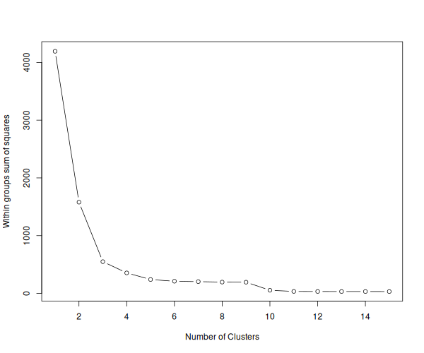
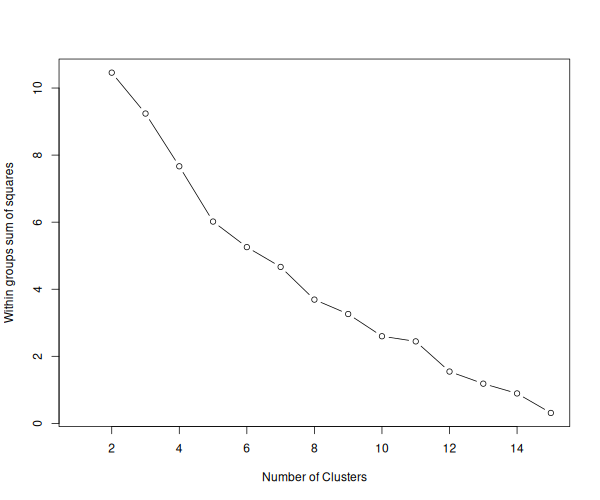
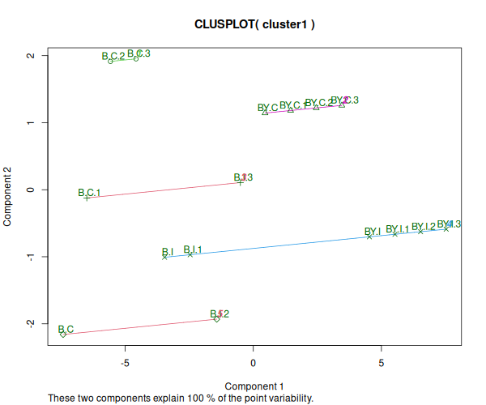

# Tarea Unidad 4 - Sesion 2

**Camilo Cabrera 23.12.2025**

---------------------------------
## Preparación de los directorios y archivos a utilizar

La tarea fue ejecutada mediante R utilizando el script [`clustering_tarea.R`](./code/clustering_tarea.R) que fue realizado en base al tutorial de [análisis de clustering](https://github.com/u-genoma/BioinfinvRepro/blob/master/Unidad4/Sesion2/Tutorial_Analisis_de_clustering.md). La normalización requerida para el proceso de clustering se realizó mediante el script [`norm_data.R`](./code/norm_data.R) que fue copiado y adaptado del script presentado en el tutorial de [análisis de clustering](https://github.com/u-genoma/BioinfinvRepro/blob/master/Unidad4/Sesion2/Tutorial_Analisis_de_clustering.md). Los datos requeridos se conservan del [tutorial anterior](../Tarea_4.1/code/). El orden de los directorios es el siguiente:

```R
/Tareas_BioinfRepro2025_CDCG/
└── Tarea_4.2/
    ├── code/
    ├── results/           
    └── Ejercicios_tarea_4.2.md
```

## Clustering

El pre procesamiento se realizó conforme a lo dictado en el tutorial, pero se realizó una adaptación al script para utilizar los datos obtenidos de el análisis DE. Se conservó todo el script original, pero luego de exportar el archivo normalizado, se añadió lo siguiente:

```R
# 1. Cargar la tabla de resultados DE
if (file.exists("DE_results.csv")) {
  
  de_results <- read.csv("DE_results.csv")
  
  # 2. Definir el umbral de FDR (El mismo de la tarea anterior: 0.19)
  fdr_th <- 0.19
  
  # 3. Limpieza de IDs (igual que en el tutorial anterior)
  # Usamos EntrezID como identificador principa
  de_results$GeneID <- de_results$EntrezID
  de_results$GeneID[is.na(de_results$GeneID)] <- de_results$ProbeID[is.na(de_results$GeneID)]
  
  # 4. Aplicar el filtro de la tarea
  # a) Identificar sondas significativas en alguno de los contrastes
  Probes.Sig <- de_results[, c("FDR.Geno", "FDR.Trt", "FDR.Int")] <= fdr_th
  
  # b) Determinar genes significativos en que todas sus sondas lo sean
  Genes.Sig_Logic <- apply(Probes.Sig, 2, tapply, de_results$GeneID, all)
  
  # c) Quedarse con genes que pasen el filtro en al menos una condición (Geno, Trt o Int)
  # rowSums > 0 significa que fue TRUE para al menos una columna
  Genes.To.Keep <- rownames(Genes.Sig_Logic)[rowSums(Genes.Sig_Logic, na.rm=TRUE) > 0]
  
  # 5. Filtrar la matriz 'normdata'
  # Primero se alinean los IDs en la anotación que ya esta cargada en memoria ('annot')
  annot$GeneID <- annot$EntrezID
  annot$GeneID[is.na(annot$GeneID)] <- annot$ProbeID[is.na(annot$GeneID)]
  
  # Vector lógico: La sonda pertenece a uno de los genes seleccionados?
  keep_probes <- annot$GeneID %in% Genes.To.Keep
  normdata_deg <- normdata[keep_probes, ]
  
  # 6. Exportar la matriz filtrada
  # Se guaarda en 'outdir' (../results), con un nombre ligeramente distinto.
  write.table(normdata_deg, file.path(outdir, "normdata_DEGs.txt"), sep="\t", row.names=TRUE)
  cat("Dimensiones finales:", nrow(normdata_deg), "sondas x", ncol(normdata_deg), "muestras.\n")
```
Una vez obtenido exportado el archivo `normdata_DEGs.txt` se utiliza el script `clustering_tarea.R` para realizar todo el análisis, este fue modificado en torno a los pasos donde se requiere observar los gráficos para determinar el número de grupos (método del codo). En este caso para las sondas se observó lo siguiente:



*Figura 1: suma de cuadrados para la determinación de grupos en las sondas*

Por lo tanto, bajo esta premisa se utilizaron `k=4` en los análisis debido a que la pendiente en el número 4 de grupos deja de bajar de forma pronunciada. El script de clustering sería el siguiente:

```R
#Seleccion de grupos por metodo del codo (4 en este caso)
fit <- kmeans(mydata[-1], 4)
class(fit)
mydata2 <- data.frame(mydata, cluster = fit$cluster)
aggregate(mydata2,by=list(fit$cluster),FUN=mean)

#Creacion figura cluster pkg
png(paste0(outdir,"/Clusplot_kmeans_k4.png"), width=600, heigh=500)
clusplot(mydata2, fit$cluster, color=TRUE, shade=TRUE,
         labels=2, lines=0)
dev.off()
```
Y por ende, la figura generada para mediante el análisis de componente principal sería la siguiente:


*Figura 2: análisis de componente principal para agrupamiento de sondas usando Kmeans*

Y para el caso de las muestras (con el filtro de los genes diferencialmente expresados) se observó lo siguiente:



*Figura 3: suma de cuadrados para la determinación de grupos en las muestras*

Por lo tanto, bajo esta premisa se utilizaron `k=5` en los análisis debido a que la pendiente en el número 5 de grupos deja de bajar de forma tan pronunciada. El script de clustering sería el siguiente:

```R
#Seleccion de grupos por metodo del codo (5 en este caso)
fit <- kmeans(mydata3, 5)
class(fit)
cluster1 <- data.frame(data = rownames(mydata3), cluster = fit$cluster)

#Creacion de figura cluster pkg
png(paste0(outdir,"/Clusplot2_kmeans_k5.png"), width=600, heigh=500)
clusplot(cluster1, fit$cluster, color=TRUE, shade=TRUE,
         labels=2, lines=0)
dev.off()
```
Y por ende la figura generada para mediante el análisis de componente principal sería la siguiente:



*Figura 4: análisis de componente principal para agrupamiento de muestras usando Kmeans*

En este caso se puede observar que el grupo intervenido (castrados) `B.C` y `BY.C` por lo general tienen perfiles similares y forman grupos entre sí. En el caso de los grupos intactos `B.I` y `BY.I` forman grupos entre sí igualmente. Y tambien, se puede observar que hay un cluster entre muestras ratones castrado e intactos. Esto puede deberse a el número de grupos seleccionados para el PCA.

## Clustering jerárquico

Para realizar la formación de grupos de forma jerarquica, se elaboran dendogramas de las muestras usando medida euclideana (lo solicitado) como cálculo de distancia, y en el caso de las sondas, se utiliza el complemento de correlación de pearson. En el caso de las muestras, además de usar medida euclideana para separación, se utiliza la funcón `cutree()` de R para generar 5 grupos en base a lo determinado del análisis previo.


*Figura 5: dendrograma de muestras el agrupamiento es en base a distancia euclidiana. Cajas rojas indican los grupos en base a su cercanía.*

Se puede observar que en base a este agrupamiento mediante distancia euclidiana las muestras se agrupan en su mayoría las muestras de ratones intactos entre sí y los ratones castrados entre sí. Igualmente se puede observar un grupo donde hay una muestra de raton castrado e intacto juntos, al repetirse el patrón esto puede indicar que la aleatorización de las 5000 lecturas durante el tutorial pasado lleven a que estas dos muestras sean similares en torno a su expresión diferencial.

Finalmente, para las sondas se realiza un clustering jerárquico, sin embargo, en este caso se utiliza el complemento de correlación de Pearson como medida para el agrupamiento, se puede observar en la siguiente figura:


*Figura 6: dendrograma de sondas el agrupamiento es en en base al complemento de correlación de Pearson.*

En este dendrograma se pueden observar 4 grupos (corte aprox en 10 de altura), sin embargo, aquí el criterio es importante puesto que hay bifurcaciones importantes dentro de los grupos observados, lo que puede llevar a tener entre 5 y 6 clústeres dentro de las sondas.

## Conclusión

El análisis de clustering realizado sobre el subconjunto de genes diferencialmente expresados (DEGs) demostró ser efectivo para revelar la estructura de los datos transcriptómicos. Se puede observar una predominancia del tratamiento (castración): Tanto el análisis de particionamiento (K-means, k=5) como el jerárquico (Distancia Euclidiana) confirman que el tratamiento (Castración vs. Intacto) es el factor principal que define la variabilidad de las muestras. Los grupos biológicos tendieron a agruparse consistentemente, validando la señal biológica detectada en el análisis de expresión diferencial previo.También se observó coherencia en los perfiles de expresión, el agrupamiento de sondas mediante correlación de Pearson y K-means (k=4) permitió identificar módulos de genes co-regulados con patrones de expresión definidos, sugiriendo bloques funcionales distintos que responden a las condiciones experimentales.

También es posible apreciar el efecto del submuestreo hay una observación de un clúster mixto (muestras castradas e intactas agrupadas juntas) sugiere una limitación técnica atribuible a la aleatorización del subconjunto de 5,000 sondas (presuntamente). Esto indica que, si bien el subset es suficiente para capturar tendencias generales, el análisis del set de datos completo es necesario para una resolución biológica definitiva y libre de artefactos estocásticos. 

En resumen, el flujo de trabajo implementado validó la consistencia biológica de los grupos experimentales y la robustez de los DEGs seleccionados bajo criterios estrictos.
